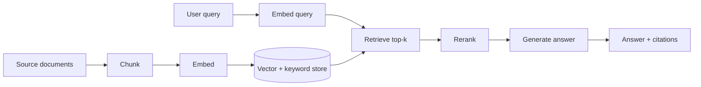

## Why RAG exists

A large language model's knowledge comes from two places: what got baked into its weights during training (parametric knowledge) and what you put in its context window at inference time. Parametric knowledge is frozen at a training cutoff, can't be audited claim-by-claim, and has no idea about your internal wiki, your customer's account history, or the PDF someone uploaded five minutes ago. Retrieval-Augmented Generation (RAG) closes that gap: instead of asking the model to recall facts from memory, you retrieve relevant passages from your own data at query time and hand them to the model as context, then ask it to answer *using that context*.

This matters for three practical reasons. First, grounding: an answer built from retrieved text can be checked against its source, which cuts hallucination compared to unaided recall. Second, freshness: update the underlying documents and the next query sees the change immediately, with no retraining. Third, access control and scope: retrieval can be filtered per user or tenant, so the model only ever sees what that caller is allowed to see — something a fine-tuned model's weights can't enforce.

RAG is not a replacement for a capable base model, and it is not free. It adds a retrieval system that must be built, indexed, evaluated, and kept in sync with the source data — and a mediocre retrieval step will make even a strong model's answers worse, because the model will faithfully summarize whatever garbage it was handed. Most of the engineering effort in a production RAG system goes into retrieval quality, not the generation call.

## The pipeline, end to end

Ingestion (left side) happens ahead of time and re-runs whenever source documents change. Query time (right side) happens on every user request. The two halves share one contract: whatever unit of text you chose to embed and store during ingestion is the unit you'll retrieve and show the model at query time — so chunking decisions made once at ingestion shape every answer downstream.

## Chunking strategies and their tradeoffs

You can't embed and search a 50-page document as one unit — embeddings compress meaning, and a single vector for a whole document is too blurry to distinguish "the section on refund policy" from "the section on shipping." So you split documents into chunks first. Every chunking strategy trades off two things: chunks small enough to be topically coherent (so a query about refunds doesn't pull in irrelevant shipping text) against chunks large enough to preserve context (so a chunk isn't just a fragment that means nothing on its own).

- **Fixed-size chunking** (e.g. 500 tokens with 10-20% overlap) is simple and fast, but cuts through sentences and sections arbitrarily. The overlap is a bandage: it means a fact split across a chunk boundary usually survives in at least one chunk, at the cost of storing and indexing redundant text.
- **Recursive/structure-aware chunking** splits on natural boundaries — paragraphs, then sentences, then words, falling back only when a boundary type doesn't produce small-enough pieces. This respects document structure (headings, lists, code blocks) far better than fixed-size splitting and is the reasonable default for most text.
- **Semantic chunking** groups sentences by embedding similarity, starting a new chunk when consecutive sentences diverge in topic. It produces more topically coherent chunks than fixed-size splitting, at the cost of an extra embedding pass during ingestion and less predictable chunk sizes.
- **Document-aware chunking** treats structural units — a Markdown section, a table, a function in source code — as the natural chunk boundary. For structured content (API docs, contracts with numbered clauses, codebases) this consistently outperforms generic splitting, because the boundaries already carry human-authored meaning.

A chunk that reads clearly on its own to a human skimming it will usually retrieve and generate well; a chunk that only makes sense in the context of the paragraph before it is a sign your boundaries are wrong. The single biggest chunking failure mode in production systems is losing the surrounding context a chunk needs to be findable — a chunk that says "revenue grew 3% year over year" is useless in isolation if it doesn't say which company or which year. Anthropic's engineering write-up on *Contextual Retrieval* addresses exactly this: before embedding and indexing each chunk, an LLM prepends a short (50-100 token) explanatory blurb situating that chunk within the whole document, generated cheaply using prompt caching against the full document. In their reported evaluation, this alone cut retrieval failure rate by 35%; combined with keyword search it reached 49%; combined with keyword search and reranking, 67% (source: Anthropic, "Introducing Contextual Retrieval," docs.claude.com / anthropic.com — worth reading directly, since exact figures and the reference implementation may be refined over time).

## Embeddings and vector similarity

An embedding model maps a chunk of text to a fixed-length vector such that semantically similar text ends up close together in that vector space, typically measured with cosine similarity or dot product. This is what lets a query like "how do I get a refund" retrieve a chunk about "return and reimbursement policy" even though they share almost no words — the embedding captures meaning, not just tokens.

Two practical decisions matter more than which specific embedding model you pick (model rankings shift constantly, so treat any specific benchmark number as a snapshot in time, not a durable fact):

1. **Match your embedding model to your domain.** A general-purpose embedding model trained mostly on web text will do a mediocre job distinguishing dense legal or medical terminology. Domain-specific or fine-tuned embedding models close that gap when the volume justifies the investment.
2. **Embed queries and documents with the same model and the same preprocessing.** A mismatch here (different model versions, different truncation, different casing) silently degrades similarity scores in ways that are hard to notice from spot-checking answers — you'll only see it in aggregate retrieval metrics.

Vector similarity search alone has a well-known blind spot: it's bad at exact matches. A query for an error code, a product SKU, or a person's name is a lexical match problem, and a dense embedding can rate a document containing the exact string lower than a document that's merely topically related. This is why production systems pair vector search with keyword search rather than relying on either alone.

## Hybrid search: vector + BM25

BM25 is a decades-old, well-understood lexical ranking algorithm: it scores documents by term frequency, weighted so that rare terms count more than common ones, with a length-normalization term so it doesn't just favor long documents. It has no notion of meaning — "car" and "automobile" are unrelated to it — but it's excellent at exactly what embeddings are weak at: exact terms, codes, identifiers, and rare vocabulary.

Hybrid search runs both a vector query and a BM25 (or full-text) query against the same chunk store, then merges the two ranked lists — commonly with Reciprocal Rank Fusion, which combines rankings using each result's rank position rather than trying to reconcile two different score scales. The practical effect: hybrid search recovers cases where a pure vector search misses an exact term match, and cases where pure keyword search misses a semantically related passage that doesn't share vocabulary with the query. Anthropic's Contextual Retrieval evaluation is one concrete data point for how much combining vector and BM25 search helps over vector search alone (see the failure-rate numbers above) — treat the specific percentages as evidence of direction and rough magnitude, and re-check the source for updated figures.

## Reranking

Retrieval and reranking solve different problems. Retrieval (vector + BM25) needs to be fast enough to search over potentially millions of chunks, which means using cheap approximate methods. Reranking runs after retrieval, on a much smaller candidate set (typically the top 20-100 results), using a more expensive model — usually a cross-encoder that looks at the query and each candidate chunk together, rather than comparing pre-computed independent embeddings. Because it sees the query and chunk jointly, a cross-encoder reranker can catch relevance signals that similarity search misses, at a cost that's only affordable because it's applied to a short list, not the whole corpus. Retrieve broad and cheap, then rerank narrow and precise — using a fast net to find candidates and a strict judge to order them is a pattern that recurs constantly in RAG design.

## Evaluating retrieval and generation separately

RAG failures have two independent causes, and conflating them wastes debugging time: the retriever might fail to find the right passage, or the generator might fail to use a correctly retrieved passage well. Evaluate each half on its own.

**Retrieval metrics**, computed against a labeled set of (query, relevant chunk) pairs:
- **Recall@k**: of the chunks that are actually relevant to a query, what fraction appear anywhere in the top k results? This is the metric to watch first — if the right chunk never gets retrieved, no amount of prompting fixes the answer.
- **Mean Reciprocal Rank (MRR)**: the average of 1/rank of the first relevant result across queries. A relevant chunk at position 1 scores 1.0; at position 4 it scores 0.25. This captures *how far down* the model has to look, which matters because most generation prompts only pass the top few chunks.

**Generation metrics**, evaluated on the model's answer given the retrieved context:
- **Faithfulness** (also called groundedness): what fraction of claims in the generated answer are actually supported by the retrieved context? A low faithfulness score with high retrieval recall means the retriever did its job and the generator ignored or embellished on the evidence — a prompting problem, not a retrieval problem.
- **Answer relevance**: does the answer actually address the question asked, independent of whether it's grounded? A faithful but irrelevant answer (accurately summarizing the wrong passage) still fails the user.

Splitting these two categories turns "the RAG system gives bad answers" into an actionable diagnosis: low recall@k means fix chunking, embeddings, or hybrid search; high recall@k but low faithfulness means fix the generation prompt or add explicit citation requirements.

## Enterprise implementation

Consider a B2B software company building a support copilot over its product documentation, API reference, and a few years of resolved support tickets. In the first internal beta, the copilot's answers looked plausible but support engineers kept flagging that it cited the wrong API version or missed a caveat mentioned in a closely related doc page. The team ran a retrieval eval with about 150 labeled (query, correct-chunk) pairs pulled from real support tickets and found recall@5 sitting at roughly 0.58 — for nearly half of real questions, the chunk that actually answered the question never made it into the top 5 passed to the model.

Two changes moved the needle. First, they switched from fixed 500-token chunking to document-aware chunking that split on the doc site's own section headings and kept each API endpoint's description, parameters, and example together as one chunk instead of splitting mid-table — fixed-size chunking had been slicing parameter tables in half. Second, they added a keyword/BM25 index alongside the existing vector index and merged results, since a large share of support queries include exact strings (error codes, endpoint paths, config flag names) that embeddings alone ranked inconsistently. After both changes, recall@5 on the same eval set rose to roughly 0.84, and MRR improved from about 0.41 to 0.67 — the right chunk wasn't just present more often, it was showing up closer to the top. They also added a lightweight faithfulness check (flagging answers containing claims not traceable to a retrieved chunk) and used it to catch a remaining failure mode: the generator occasionally combined two retrieved chunks from different product versions into one answer, which they fixed by requiring the prompt to cite the source chunk for each claim and by filtering retrieval to the product version the user had selected. None of this required a different or larger language model — the gains came entirely from retrieval quality and evaluation discipline.
