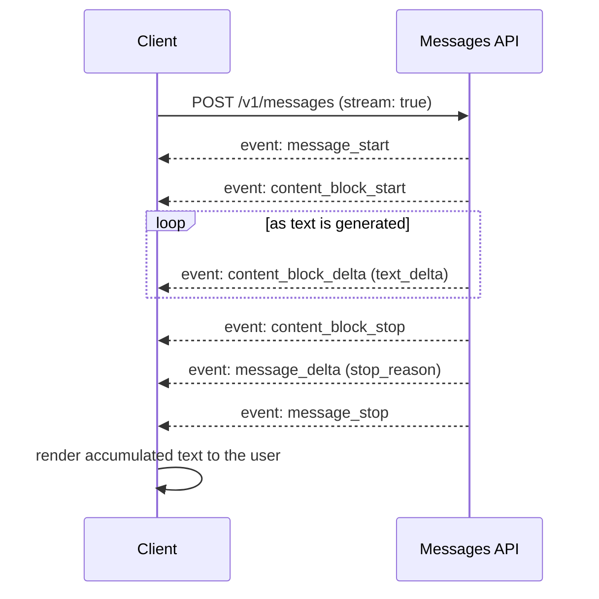

## What the Messages API actually is

Everything you do with Claude through the API — a single question-answer exchange, a multi-turn chat, an agent that calls tools in a loop — goes through one HTTP endpoint: `POST /v1/messages`. There's no separate "chat" endpoint and a different "completion" endpoint. Tool use, vision input, extended thinking, and structured outputs are all just parameters on the same request. Once you understand the shape of a Messages API request and response, you understand the foundation of every Claude integration, no matter how sophisticated it eventually gets.

This module covers that foundation: the request shape, how conversations actually work across multiple turns, streaming, why generation stops when it does, token counting, official SDKs, and what happens when something goes wrong (errors and rate limits). The follow-on modules in this line build tool use, agents, and prompt engineering on top of what you learn here.

## The core request shape

A minimal request needs three things: a `model`, a `max_tokens` value, and a `messages` array.

```json
{
  "model": "claude-sonnet-5",
  "max_tokens": 1024,
  "messages": [
    { "role": "user", "content": "What is the capital of France?" }
  ]
}
```

- **`model`** identifies which Claude model handles the request. Anthropic ships new models regularly, and each has its own capabilities and pricing — treat the specific model ID as something you look up when you build, not something to memorize. Always read it from configuration or an environment variable rather than hard-coding it in application code, so a model upgrade is a config change, not a redeploy.
- **`max_tokens`** is the *maximum* number of tokens the model is allowed to generate for this response — an upper bound, not a target. The model can (and usually does) stop well before it, and hitting the cap mid-thought is a specific stop condition you should handle explicitly (see Stop reasons, below).
- **`messages`** is an ordered array of turns, each with a `role` (`user` or `assistant`) and `content`. Content can be a plain string or an array of typed content blocks (text, image, document, tool use, tool result, and so on) — the array form is what lets a single message mix, say, an image and a question about it.

Alongside these, a **`system`** parameter carries instructions that apply to the whole conversation — persona, constraints, output format, background context — separately from the turn-by-turn `messages`. Keeping instructions in `system` rather than folded into the first user message keeps the model's role clear and, in practice, tends to produce more reliable adherence to your constraints.

```json
{
  "model": "claude-sonnet-5",
  "max_tokens": 1024,
  "system": "You are a concise technical writing assistant. Answer in plain prose, no bullet points unless asked.",
  "messages": [
    { "role": "user", "content": "Explain what a race condition is." }
  ]
}
```

The response comes back as a JSON object with an `id`, a `role` of `"assistant"`, a `content` array of blocks (usually one `text` block for a plain-text reply), a `stop_reason`, and a `usage` object reporting `input_tokens` and `output_tokens` for that exchange.

## The API is stateless: you resend the history

This is the single most important operational fact about the Messages API: **it has no memory of previous requests.** Every call is independent. If you want a multi-turn conversation — where Claude remembers that the user said their name is Alice two turns ago — your client is responsible for resending the entire conversation history as the `messages` array on every request.

```json
{
  "model": "claude-sonnet-5",
  "max_tokens": 1024,
  "messages": [
    { "role": "user", "content": "My name is Alice." },
    { "role": "assistant", "content": "Hello Alice! Nice to meet you." },
    { "role": "user", "content": "What's my name?" }
  ]
}
```

Each turn you append is the model's *own prior output*, sent back verbatim — the assistant turns in that array should be exactly what the API returned, not a paraphrase. The practical implications matter for anyone building a real application:

- **Your server (or client) owns conversation state**, typically in a database keyed by conversation ID. The API itself never persists it for you.
- **Cost and latency both grow with the conversation.** A ten-turn conversation resends nine previous turns' worth of tokens on every new request. This is why prompt caching (letting the API skip re-processing an unchanged prefix of the conversation) becomes important for any chat-shaped product at scale — it's a distinct topic worth its own module, but the shape of the problem starts here.
- **You control what history looks like.** You can summarize, truncate, or drop old turns before resending — the API doesn't enforce that you send the literal unmodified transcript, only that whatever you send is coherent (for example, the first message must be from the `user`, and you generally shouldn't edit the content of assistant turns you've already received).
- **Very long conversations can approach the model's context window** (the total number of tokens, input and output combined, that fit in a single request). At that point you need a strategy — summarization, trimming older turns, or dedicated context-management features — rather than just letting requests grow indefinitely.

## Streaming responses

By default, a request waits until the full response is generated before returning anything. For anything long, or anything with a human watching a screen, that's a poor experience — set `"stream": true` and the API instead returns the response incrementally over Server-Sent Events (SSE) as it's generated.

A streamed response is a sequence of typed events, not a stream of raw text. Conceptually:

1. A `message_start` event opens the response (with an initially-empty `content` array).
2. For each content block, a `content_block_start` event, one or more `content_block_delta` events (the actual incremental text, arriving piece by piece), and a `content_block_stop` event.
3. One or more `message_delta` events carrying top-level changes to the response, including the final `stop_reason`.
4. A `message_stop` event closes the response.

`ping` events may appear at any point to keep the connection alive, and — because streaming responses have already sent a `200 OK` before generation finishes — an `error` event can still appear mid-stream (for example, if the service becomes overloaded partway through), so stream consumers need their own error handling distinct from the normal HTTP-status-code path.



Each official SDK provides helpers so you don't have to hand-parse SSE: a text-only stream you can iterate over token-by-token, and a way to get the fully-accumulated final message object if you don't need to react to individual events — useful when you want streaming purely to avoid HTTP timeouts on a long response, without building incremental UI.

## Stop reasons: why generation ends

Every response carries a `stop_reason` field explaining why the model stopped generating. Handling it correctly is the difference between an application that silently mishandles a truncated answer and one that behaves predictably. Conceptually, generation stops for one of a small number of reasons:

- The model reached a natural completion point and has nothing more to say.
- The model hit the `max_tokens` ceiling you set — the response is truncated mid-thought, and if your application treats this the same as a normal completion, it will silently ship cut-off answers. Detect this case and either raise `max_tokens` and retry, or handle a partial answer deliberately.
- The model produced a custom stop sequence you configured, if you're using that feature to bound output to a specific delimiter.
- The model wants to call a tool it was given — this is the mechanic that makes tool use and agents possible, covered in a later module.
- The model paused mid-turn in a way that can be resumed, relevant to some agentic and tool-use flows.
- A safety-related decline occurred, in which case a separate structured field on the response describes the category — always check whether this field is populated rather than assuming a refusal looks like ordinary text.

The practical rule: **always branch on `stop_reason` before you trust `content` as a complete answer.** An application that just reads `content[0].text` and displays it will, sooner or later, ship a truncated or declined response to a user without knowing it happened.

## Token counting

Claude — like other large language models — doesn't process text character by character; it processes *tokens*, roughly word-and-subword-sized chunks. Every request and response reports token counts (`usage.input_tokens` and `usage.output_tokens`), and those counts are what you're billed on and what count against your context window and rate limits.

Because pricing and rate limits are both token-denominated, knowing your token count *before* you send a request is often worth doing — for cost estimation, for staying under a context window, or for deciding whether to trim a conversation before resending it. The Messages API exposes a dedicated token-counting endpoint for exactly this: you send the same `model`, `system`, and `messages` you'd send to generate a response, and get back a token count without any generation happening (and without being billed for output). This is the right tool for the job — don't estimate tokens by counting words or characters, and don't reach for a general-purpose tokenizer library that wasn't built for Claude's tokenizer.

## Official SDKs

Anthropic publishes official SDKs for several languages, including Python, TypeScript, Go, Java, Ruby, C#, and PHP, each wrapping the same underlying HTTP API. Reaching for the SDK instead of hand-rolling HTTP calls buys you a few things every production integration eventually wants: typed request/response objects, automatic retries with backoff for transient failures (connection errors, rate limits, server errors), streaming helpers that parse SSE for you, and typed exception classes for error handling instead of string-matching on error messages. Unless you have a specific reason to speak raw HTTP — a language without an official SDK, or a constrained runtime — prefer the SDK.

All the SDKs resolve credentials the same conceptual way: an API key supplied via an environment variable by default, with no key hard-coded into source. Keeping that key out of client-side code is a hard requirement for any application with a browser or mobile frontend — API calls to Claude belong on your server, never in code that ships to an end user's device.

## Errors and rate limits

Requests fail for two broad reasons: something was wrong with the request itself, or you've exceeded a usage limit.

**Errors** follow a predictable pattern: an HTTP status code plus a JSON body with a top-level `error` object carrying a `type` and a `message`, and a `request_id` you'd hand to support if you needed help debugging a specific call. A 400-level status generally means something about the request needs fixing (malformed input, missing a required field) — retrying the identical request won't help. A 5xx-level status means something went wrong on the service side, and retrying — ideally with exponential backoff, which the official SDKs do for you automatically — is the right move. Streaming responses complicate this slightly: because the HTTP status is already a success by the time streaming starts, a failure partway through a stream arrives as an error *event* in the SSE stream rather than as an HTTP error, so stream consumers need to watch for that explicitly.

**Rate limits** are separate from errors caused by bad requests, and exist to keep the service fair and stable under load. Anthropic enforces limits along a few dimensions conceptually: how many requests you can make in a period of time, and how many input and output tokens you can process in a period of time, evaluated per model. Exceeding any of them returns a `429` status with an error indicating a rate limit was hit, generally along with a header telling you how long to wait before retrying. Response headers also expose your current limit, how much you have remaining, and when it resets — useful for building a client that backs off proactively instead of just reacting to failures. Separately, an organization can also have a monthly spend cap; hitting that is a distinct condition from a short-term rate limit, since it doesn't resolve by waiting a few seconds.

The operational takeaway for anything beyond a demo: treat rate limiting as a normal, expected condition your application handles gracefully (backoff and retry, or queuing), not an exceptional failure. High-traffic production systems generally reduce how often they hit these limits in the first place by using prompt caching to shrink the tokens they resend on every request, and by batching latency-insensitive work instead of sending it through the same real-time request path as user-facing traffic.

## Enterprise implementation

Consider a customer support platform that receives a high volume of inbound support tickets and needs to route each one to the right team, at the right priority, before a human ever looks at it. Doing this by hand-written rules (keyword matching, regexes on subject lines) tends to be brittle — new phrasing, ambiguous requests, and multi-issue tickets all break simple rule sets. A Messages API call, run as one step in the ticket-ingestion pipeline, can classify a ticket's category and urgency from its free-text content far more robustly, without needing a dedicated ML pipeline or training data.

The integration sits behind the ticket-creation endpoint: as soon as a new ticket lands, the backend sends its subject and body to Claude with a system prompt describing the categories and priority levels the support team actually uses, and asks for a structured result it can act on programmatically — here, using the API's ability to constrain the response to a specific JSON shape rather than parsing free text out of a normal reply.

```json
// POST https://api.anthropic.com/v1/messages
{
  "model": "claude-sonnet-5",
  "max_tokens": 512,
  "system": "You triage inbound customer support tickets for a SaaS billing product. Classify each ticket into exactly one category from: billing, account_access, bug_report, feature_request, other. Assign an urgency of low, medium, or high based on business impact and customer language, not just politeness. Respond only with the structured output requested.",
  "messages": [
    {
      "role": "user",
      "content": "Subject: Can't log in, invoice is due tomorrow\n\nBody: I've been locked out of my account since this morning and I have an invoice due tomorrow that I need to review before approving payment. This is blocking my finance team. Please help urgently."
    }
  ],
  "output_config": {
    "format": {
      "type": "json_schema",
      "schema": {
        "type": "object",
        "properties": {
          "category": {
            "type": "string",
            "enum": ["billing", "account_access", "bug_report", "feature_request", "other"]
          },
          "urgency": { "type": "string", "enum": ["low", "medium", "high"] },
          "reasoning": { "type": "string" }
        },
        "required": ["category", "urgency", "reasoning"],
        "additionalProperties": false
      }
    }
  }
}
```

A representative response:

```json
{
  "id": "msg_01Xy...",
  "type": "message",
  "role": "assistant",
  "content": [
    {
      "type": "text",
      "text": "{\"category\":\"account_access\",\"urgency\":\"high\",\"reasoning\":\"Customer is locked out and has a time-sensitive billing deadline tomorrow, with explicit escalation language ('blocking my finance team', 'urgently').\"}"
    }
  ],
  "stop_reason": "end_turn",
  "usage": { "input_tokens": 143, "output_tokens": 58 }
}
```

The pipeline parses that JSON, routes `account_access` + `high` tickets to the on-call access-recovery queue with an SLA timer, and logs the `reasoning` field alongside the ticket for the human agent who eventually picks it up — so the person handling the ticket sees *why* it was routed that way, not just the label. Because the request is stateless and self-contained (no conversation history needed — each ticket is triaged independently), it's a clean fit for a request-response step inside an existing pipeline rather than something that needs conversational state or a chat UI. At scale, the team would monitor `usage.input_tokens` and `usage.output_tokens` across triage calls to track cost per ticket, watch for `stop_reason: "max_tokens"` as a signal that `max_tokens` is too tight for a small structured response, and handle `429`s from a traffic spike (a product outage that generates thousands of tickets in minutes) with a backoff-and-queue strategy rather than dropping tickets or blocking ticket creation on a slow retry.
