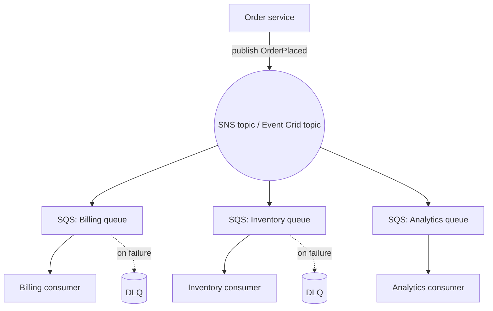

## Point-to-point vs fan-out

Most integration problems come down to one question: does exactly one consumer need this message, or does the message need to reach several independent consumers?

**Point-to-point** messaging is a queue: a producer drops a message in, and exactly one consumer picks it up and processes it. If you have three workers pulling from the same queue, they're competing for messages, not each getting a copy — this is how you scale out processing of a backlog without duplicating work. Order processing, image resizing jobs, and "do this task once" workloads are point-to-point.

**Fan-out** (publish/subscribe) is the opposite: one event, many independent consumers, each getting its own copy. When an order is placed, the billing service, the inventory service, and the analytics pipeline all need to know — independently, without the order service having to know they exist or call each of them directly. That's fan-out, and it's the backbone of decoupled, event-driven architecture: producers stop caring who's listening, and new consumers can subscribe without any change to the producer.

Both AWS and Azure give you managed primitives for each pattern, and the practical skill is picking the right one and combining them correctly — not memorizing every service's feature list.

## Amazon SQS: point-to-point queuing

Amazon SQS (Simple Queue Service) is the point-to-point primitive on AWS. Producers send messages to a queue; consumers poll the queue and process messages one at a time (or in batches). SQS comes in two queue types with materially different guarantees.

**Standard queues** offer at-least-once delivery and best-effort ordering. Under the hood, SQS is a distributed system, and that scale means a message can occasionally be delivered more than once, and messages can occasionally arrive out of order. In exchange, standard queues scale to very high, effectively unbounded throughput. Most workloads should default to standard queues and be built to tolerate duplicate delivery — consumers should be idempotent (safe to process the same message twice) rather than relying on the queue to prevent duplicates.

**FIFO queues** guarantee ordering and exactly-once processing, but only within a *message group* — messages sharing the same `MessageGroupId` are delivered in the order they were sent, and duplicates are suppressed within a deduplication window. FIFO queues trade throughput for these guarantees: they're the right choice when order genuinely matters (e.g., a sequence of state-change events for a single account) but the wrong default for everything else, because the ordering guarantee forces more serialized processing.

### Visibility timeout

When a consumer receives a message from SQS, the message isn't deleted — it becomes temporarily invisible to other consumers for a configurable **visibility timeout** (commonly defaulting to 30 seconds in examples, but always check current limits in the docs since these numbers can change). The consumer is expected to process the message and explicitly delete it before the timeout expires. If it doesn't — because the consumer crashed, hung, or is just slow — the message becomes visible again and another consumer picks it up.

This is the mechanism that makes SQS resilient to consumer failure: a crashed worker doesn't lose messages, it just returns them to the pool after a delay. The practical implication is that your visibility timeout should be set comfortably longer than your typical processing time (a common rule of thumb is 6x your average processing time), or you'll see the same message reprocessed by multiple consumers even when nothing actually failed.

### Dead-letter queues and redrive

Some messages can't be processed no matter how many times you retry them — malformed payloads, a downstream dependency that will never accept this particular record, a bug that only one edge case triggers. Left alone, these "poison messages" would cycle through visibility timeout and redelivery forever, blocking real work and burning consumer capacity.

A **dead-letter queue (DLQ)** breaks that cycle. You attach a redrive policy to the source queue specifying a target DLQ and a `maxReceiveCount` — the number of delivery attempts allowed before SQS automatically moves the message to the DLQ instead of redelivering it to consumers. Once in the DLQ, the message stops interfering with the healthy flow, and you can inspect it, alert on it, fix the root cause, and then **redrive** it — replay it back into the original queue — once the fix is deployed. Every production queue that matters should have a DLQ; a queue without one silently drops or infinitely retries its failures.

## SNS: fan-out at the messaging layer

Amazon SNS (Simple Notification Service) is a pub/sub topic. A producer publishes one message to an SNS topic, and SNS pushes a copy to every subscriber — which can be SQS queues, Lambda functions, HTTP endpoints, email, or mobile push. The classic reliability pattern is **SNS fan-out to SQS**: publish once to SNS, have each downstream service own its own SQS queue subscribed to that topic. Each service then gets the durability and retry semantics of a queue (nothing is lost if that one service is down) while the publisher only ever talks to one topic.

Without this pattern, if the order service called billing, inventory, and analytics directly (point-to-point HTTP calls), it would need to know about every consumer, handle each one's downtime, and get slower every time a new consumer is added. Fan-out inverts that: the producer publishes once and stays fast; consumers subscribe and unsubscribe without the producer changing at all.

## EventBridge: routing, not just fan-out

Amazon EventBridge looks superficially similar to SNS — it also distributes events to multiple targets — but it solves a different problem: **routing logic**, not just fan-out. Where SNS delivers every message to every subscriber (filtering is limited), EventBridge's **rules** match on the actual structure and field values of an event and route matching events to different targets. One event bus can host many independent rules, each expressing "if the event looks like this, send it there" — closer to a real event router than a broadcast topic.

EventBridge also adds a **schema registry**: it can discover the shape of events flowing through a bus, version those schemas automatically, and generate strongly-typed bindings for your code, so consuming teams aren't reverse-engineering payload shapes from example JSON. It supports **archive and replay** of events, and it can ingest events directly from many AWS services and third-party SaaS integrations without custom polling.

So when do you reach for which? A reasonable rule of thumb:

- **SQS** when you need a durable buffer between a producer and exactly the consumers of one queue, with retry and backpressure — the classic "smooth out a spike, don't lose work" tool.
- **SNS** when you need to fan the same event out to several independent consumers with minimal routing logic, especially when SMS/email/push endpoints are involved.
- **EventBridge** when different consumers care about different subsets of a broader stream of domain events, when you want schema discovery/versioning, or when you're integrating with many SaaS event sources.

These aren't mutually exclusive. A common combined pattern is EventBridge routing an event to SNS for fan-out, with each SNS subscriber being its own SQS queue — EventBridge handles the "which of these many event types goes where" decision, SNS handles broadcasting, and SQS gives each consumer its own durable, retryable inbox.

## Azure equivalents

Azure splits the same responsibilities across two primary services, plus a third for high-throughput streaming.

**Azure Service Bus** covers both point-to-point and pub/sub, in one service. A Service Bus **queue** behaves like SQS: point-to-point, first-in-first-out per queue, with a visibility-timeout-like "lock duration" during which a received message is invisible to other receivers, and a dead-letter sub-queue that messages land in after exceeding a max delivery count (mirroring SQS's redrive policy). A Service Bus **topic** adds pub/sub on top: a topic can have multiple **subscriptions**, each of which can apply its own SQL-like filter rule to receive only the messages it cares about — a topic with subscriptions is roughly SNS-fan-out-to-SQS collapsed into one service, since each subscription already behaves like its own durable queue. Service Bus also supports sessions (ordered processing of related messages, similar in spirit to an SQS FIFO message group), scheduled delivery, and duplicate detection.

**Azure Event Grid** is the routing/fan-out layer, closer to EventBridge: it reacts to events from Azure services or custom publishers and pushes them to subscribers (Functions, Logic Apps, webhooks, Service Bus, Event Hubs) using filterable event subscriptions. The key architectural difference from Service Bus queues is that Event Grid is push-based and does not durably hold messages the way a queue does — if a subscriber can't be reached, delivery relies on Event Grid's retry policy rather than the message sitting safely in a queue indefinitely, so wiring an Event Grid subscription to *deliver into* a Service Bus queue (rather than straight to a webhook) is a common way to get durable buffering back.

**Azure Event Hubs** (not the focus of this module, but worth placing on the map) is a high-throughput event *streaming* service — closer to a log you replay than a queue you drain — for telemetry and analytics ingestion at very high volume, with multiple independent consumer groups reading the same stream.

| Responsibility | AWS | Azure |
|---|---|---|
| Point-to-point queue | SQS (standard / FIFO) | Service Bus queue |
| Pub/sub fan-out with durable per-consumer buffering | SNS → SQS | Service Bus topic + subscriptions |
| Event routing by content, schema registry, SaaS ingestion | EventBridge | Event Grid |
| High-throughput event streaming / replay | Kinesis (related, not covered here) | Event Hubs |

The mapping isn't perfect — Service Bus topics fold SNS+SQS into one service, and Event Grid is push-only where EventBridge targets can include durable queues directly — but it's a useful first approximation when you already know one cloud and need to translate to the other.

## Enterprise implementation

Consider a multi-tenant SaaS platform running project-management software for several thousand customer organizations. Every time a user updates a task — reassigns it, changes its status, attaches a file — the platform needs to: reindex the task for search, notify any teammates watching that task, update a usage-billing counter for the tenant, and feed an audit log required for the platform's compliance certifications. That's four independent downstream effects from one user action, each owned by a different internal team, each with different failure tolerance.

The naive version — the API handler calling all four services synchronously — breaks down as the platform grows. At roughly 500 task updates per second during peak hours, a single slow downstream call (the audit log service having a bad day) makes every task update in the product feel slow, and an outage in the notification service would make task updates fail outright, even though notifications have nothing to do with whether the update itself succeeded.

The fix is fan-out with each consumer owning its own durable buffer. The API handler publishes one `TaskUpdated` event to an SNS topic (or, on Azure, a Service Bus topic) as the very last step of handling the request, and returns immediately — publishing to SNS typically completes in single-digit milliseconds, versus the hundreds of milliseconds or more it took to call four services in sequence. Each of the four teams owns its own SQS queue (or Service Bus subscription) subscribed to that topic: search indexing, notifications, billing, and audit logging each pull from their own queue at their own pace.

This buys three things directly. First, isolation: if the notification service is down for twenty minutes, task updates keep flowing normally — the notification messages simply queue up and get processed once the service recovers, invisible to users making the actual task update. Second, independent scaling: the billing counter update is cheap and near-instant, while search reindexing is comparatively expensive, so each consumer scales its own worker pool independently instead of the slowest one dragging down the others. Third, safety against bad messages: each queue has its own dead-letter queue with a `maxReceiveCount` of 5, so a malformed event that would otherwise loop forever against, say, a bug in the audit-log consumer gets pulled out after five failed attempts, paged on, and redriven once fixed — without ever blocking the healthy queues.

As the platform later adds a fraud-detection team that only cares about task updates matching certain patterns (bulk reassignments, unusual after-hours activity), it becomes a case for EventBridge-style routing rather than adding another blanket SNS subscription: a rule that matches only the relevant event shapes, so the fraud team isn't paying to receive (and filter out) every task update on the platform. That's the natural progression this module set up: point-to-point queuing for isolated, retryable work; pub/sub fan-out when multiple independent consumers need the same event; and content-based routing once "some consumers only want a slice of the stream" becomes the actual requirement.
