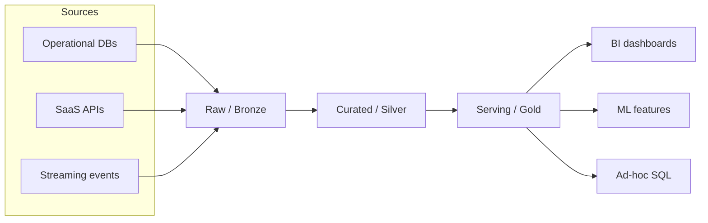
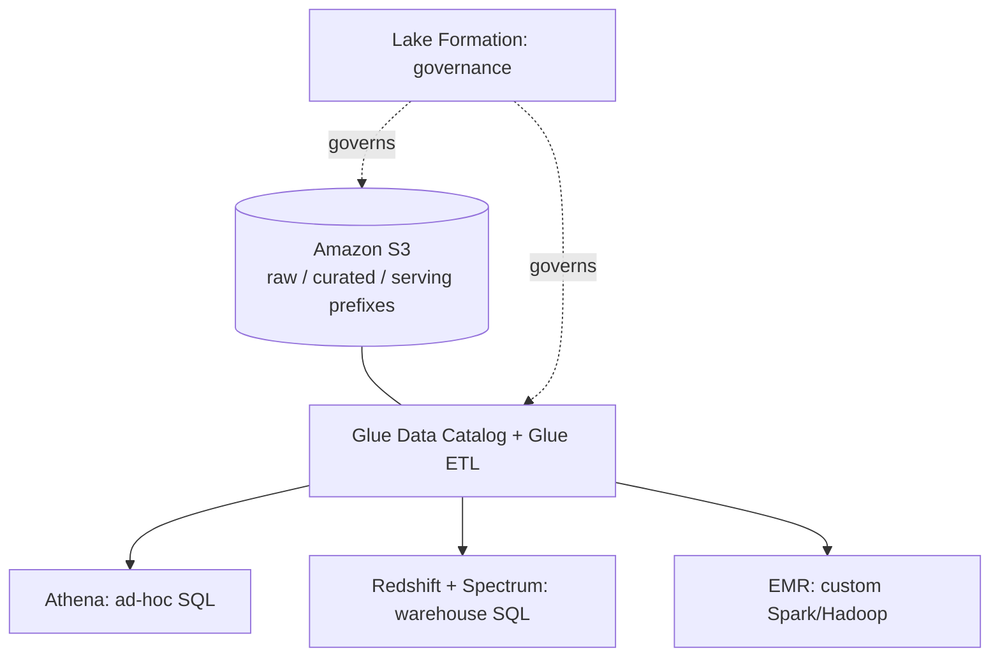

## Why compare stacks at all

Most enterprise data platforms today are built on one of two clouds, and the two clouds solve the same problems with different philosophies. AWS gives you composable, best-of-breed services that you wire together yourself. Azure — especially since the introduction of Microsoft Fabric — pushes you toward a single, opinionated SaaS surface where storage, compute, and governance are pre-integrated. Neither approach is "correct." Understanding both lets you evaluate a client's existing environment honestly instead of reaching for whichever stack you happen to know best.

This module assumes you already understand the lakehouse pattern conceptually (see the data lake and warehouse modules if not) and focuses on how AWS and Azure implement it differently.

## The lakehouse pattern, briefly

A data lakehouse combines the cheap, flexible storage of a data lake with the structure, ACID transactions, and performance guarantees of a data warehouse. Instead of choosing between "dump everything in object storage and figure it out later" and "model everything rigidly before it lands," a lakehouse stores data in open table formats (Delta Lake, Apache Iceberg, Apache Hudi) on top of object storage, and layers a metadata/catalog service on top so multiple compute engines — SQL, Spark, BI tools — can all read and write the same physical files consistently.

The data itself typically moves through layers, often called the **medallion architecture**:

- **Raw / bronze** — data landed as-is from source systems, unmodified, for lineage and replay.
- **Curated / silver** — cleaned, deduplicated, conformed to a schema, joined with reference data.
- **Serving / gold** — aggregated, business-ready tables optimized for the queries that consume them (dashboards, ML features, reports).

This pattern is vendor-neutral — it is a way of organizing data and responsibility, not a product. What differs between AWS and Azure is which services implement each layer, how tightly they're integrated, and who owns the metadata.

## AWS's stack: composable services, S3 at the center

AWS treats **Amazon S3** as the universal substrate. Nearly every AWS analytics service reads from and writes to S3 directly; there's no separate "lake storage product" the way OneLake exists on Azure. This has a real consequence: your raw, curated, and serving layers are usually just different S3 prefixes (or buckets) with different table formats and access policies, not different pieces of infrastructure.

Around that S3-centric lake, the core services are:

- **AWS Glue** — a managed ETL and cataloging service. Glue crawlers scan data in S3 and infer schema into the **Glue Data Catalog**, a Hive-metastore-compatible metadata repository that other services (Athena, Redshift Spectrum, EMR, third-party tools) read from. Glue also runs serverless Spark jobs for transformation between medallion layers, and Glue Studio gives a visual ETL authoring experience for teams that don't want to hand-write Spark.
- **Amazon Athena** — serverless, pay-per-query SQL directly against data in S3, using the Glue Data Catalog for schema. This is the tool of choice for ad-hoc analysis and for teams who don't want to provision a warehouse cluster at all.
- **Amazon Redshift** — the managed data warehouse, used for the serving layer when you need consistent, high-concurrency SQL performance, materialized views, and workload management for BI tools. Redshift Spectrum extends Redshift's query engine over data still sitting in S3, so you can join warehouse tables with lake data without loading everything into Redshift first.
- **Amazon EMR** — managed Hadoop/Spark clusters for large-scale, custom processing that goes beyond what Glue's serverless jobs comfortably handle — long-running Spark pipelines, custom libraries, or workloads that need direct cluster tuning.
- **AWS Lake Formation** — governance on top of S3 and the Glue Data Catalog: centralized, fine-grained permissions (down to column and row level on supported engines) so you don't have to replicate IAM policies across every consuming service individually.

The philosophy is: pick the specific engine for the specific job, and let S3 plus the Glue Data Catalog be the shared contract between them. This gives flexibility — you can swap Athena for EMR for a particular workload without moving data — at the cost of more moving parts to configure, secure, and keep consistent.

## Azure's stack: an increasingly unified SaaS surface

Azure's historical stack looked similar to AWS's in shape: **Azure Data Lake Storage (ADLS) Gen2** as the object storage layer (built on Blob Storage with a hierarchical namespace), **Azure Synapse Analytics** as the combined warehouse-and-big-data-processing service (dedicated SQL pools for warehousing, serverless SQL pools for ad-hoc querying over the lake, and Spark pools for processing), and **Azure Data Factory** for orchestration and ETL/ELT pipelines.

The newer, and increasingly primary, entry point is **Microsoft Fabric**, a SaaS platform that consolidates Synapse's engines, Data Factory, and Power BI under one product with a shared storage layer called **OneLake**. OneLake is built on ADLS Gen2 but presents a single logical lake for an entire organization ("one copy of data, many compute engines"), storing data in an open table format so that a Lakehouse item, a Warehouse item, and a Power BI semantic model can all reference the same underlying files without separate copies or separate ETL to keep them in sync.

In a Fabric-based medallion implementation, the layers map roughly to:

- **Bronze** — a Fabric **Lakehouse** item receiving raw data via Data Factory pipelines or Eventstream (for streaming sources).
- **Silver** — the same or a second Lakehouse, cleaned and conformed via Spark notebooks or Dataflows.
- **Gold** — a Fabric **Warehouse** item (T-SQL, warehouse semantics) or a curated Lakehouse table, consumed directly by Power BI without a separate extract step.

The Azure/Fabric philosophy is close to the opposite of AWS's: instead of choosing a specific engine per job and connecting them yourself, you work inside one product where storage is shared by default and the main decision is which *compute experience* — SQL warehouse, Spark notebook, Power BI — you use against the same data. This reduces integration work but means you are more committed to the platform's way of doing things, and its workload boundaries (what's Fabric-native versus what still requires classic Synapse or standalone ADLS) are still evolving — worth checking current documentation before committing an architecture to it.

## Comparing the two philosophies

| Dimension | AWS | Azure (Synapse / Fabric) |
|---|---|---|
| Storage model | S3 buckets/prefixes; no single "lake" abstraction, format and layout are your convention | OneLake: one logical, tenant-wide lake; Fabric items reference it directly |
| Metadata/catalog | Glue Data Catalog, shared across many services | Increasingly unified inside Fabric's workspace/OneLake model |
| Compute engines | Separate services you choose and wire together (Athena, Redshift, EMR, Glue) | Mostly unified inside one SaaS product (Fabric), or the older Synapse pools |
| Governance | Lake Formation, layered on top of IAM | Fabric workspace roles / Microsoft Purview integration |
| Integration effort | Higher — you own the wiring between services | Lower — more pre-integrated, less flexible to substitute pieces |
| Best fit | Teams wanting to mix and match engines, or already deep in AWS | Teams standardizing on Microsoft 365/Power BI, wanting less integration work |

Both approaches converge on the same underlying idea — open table formats over object storage, separated raw/curated/serving layers, and a catalog that lets multiple engines share data — they just differ in how much of the wiring is a platform decision versus your decision.

## How to choose

In practice, the choice is rarely made on lakehouse architecture merits alone. What actually decides it:

1. **Existing organizational commitment.** A company already standardized on Microsoft 365, Power BI, and Azure AD will get far more leverage from Fabric's tight integration than from bolting on AWS services. The reverse is true for an org already deep in AWS IAM, VPCs, and existing Glue jobs.
2. **Team skill composition.** A team strong in Spark and comfortable managing infrastructure will be productive with AWS's composable services. A team that's mostly SQL and Power BI analysts will move faster inside Fabric's unified workspace.
3. **Need for engine substitutability.** If you expect to swap in a different query engine, run custom Spark clusters, or integrate open-source tools (Trino, dbt, Airflow) directly against your lake, AWS's "storage is just S3" model makes that easier — nothing about the lake itself assumes a specific engine.
4. **Governance and compliance requirements.** Both platforms support fine-grained access control (Lake Formation vs. Fabric workspace roles plus Purview), but the operational model differs enough that existing compliance tooling often tips the decision.
5. **Cost model tolerance.** AWS's per-service pricing (S3 storage, Glue DPU-hours, Athena per-query, Redshift per-node-hour or serverless) is granular but requires active cost management across many bills. Fabric's capacity-based pricing bundles compute across workloads into a single SKU, which simplifies budgeting but means you're purchasing capacity ahead of exact usage patterns. Specific pricing details should be verified against current vendor documentation rather than memorized, since both change often.

Neither stack is "better" in the abstract. The job of a data engineer or architect is to map the organization's existing constraints — team, tooling, governance, budget model — onto the platform that reduces total integration and operating cost, not to chase whichever service list looks more modern on a slide.

## Enterprise implementation

A regional retail chain runs its core reporting off an aging on-premises data warehouse: a single large SQL Server instance fed by nightly batch ETL from point-of-sale systems, inventory management, and a legacy CRM. Reports take until mid-morning to refresh, the warehouse is near capacity, and the team wants near-real-time inventory visibility across roughly 300 stores.

The company is already a heavy Microsoft 365 and Power BI shop — every store manager and regional director already has a Power BI license — so the data platform team scopes a migration to Microsoft Fabric rather than AWS, explicitly trading some flexibility for lower integration overhead given their existing tooling.

**Scope and timeline (illustrative, not a vendor commitment):**

- **Weeks 1–4 — landing zone.** Set up a Fabric capacity and workspace structure (dev/test/prod), configure Data Factory pipelines to land POS transactions, inventory snapshots, and CRM exports into a bronze Lakehouse, initially running side-by-side with the existing on-prem warehouse.
- **Weeks 5–10 — curated layer.** Build Spark notebook pipelines to clean and conform bronze data into a silver Lakehouse: deduplicate POS transaction feeds, standardize store and SKU identifiers across the three source systems, and backfill roughly 3 years of historical data (around 40 TB) from the legacy warehouse.
- **Weeks 11–14 — serving layer and cutover.** Build a gold Fabric Warehouse with star-schema tables for sales, inventory, and customer analytics; rebuild the highest-value Power BI reports directly against it using Direct Lake mode (querying OneLake data without a separate import/refresh step); run both systems in parallel for two weeks to validate numbers match; then cut reporting over.
- **Ongoing — inventory near-real-time feed.** Add an Eventstream ingesting POS inventory-adjustment events, landing them into the same bronze/silver/gold structure, so store managers see inventory positions with minutes of latency instead of a next-day batch.

**Expected outcome:** morning report refresh time drops from "available by 10am" to "available at store open," inventory visibility moves from next-day to near-real-time, and the team retires the on-prem SQL Server warehouse's hardware refresh, which had been the original budget trigger for the project. The team documents in their `verify` list that they will re-check Fabric capacity SKU sizing and pricing near contract renewal, since capacity units and pricing tiers are exactly the kind of vendor specific that shifts over time.

