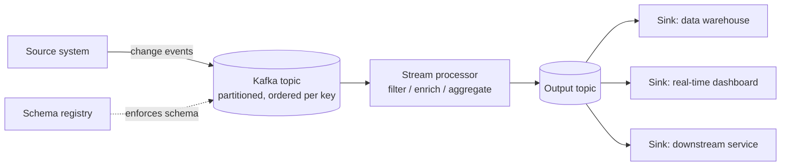

## Batch vs. streaming: two answers to the same question

Every data pipeline answers one question: how do I move data from where it's produced to where it's needed, in a shape people can use? Batch and streaming are two different answers, not two different questions, and most real systems end up using both.

**Batch processing** collects data over a window — an hour, a day — and processes it as one unit. A nightly job reads yesterday's orders table, joins it against a dimension table, and writes an aggregated report. Batch is simple to reason about: a run either completes or it doesn't, retries are cheap because you just rerun the whole window, and the tooling (SQL, orchestrators like Airflow or Dagster) is mature and well understood.

**Stream processing** treats data as an unbounded sequence of events, processed as they arrive, typically within seconds. A ride-hailing app updating a driver's location on a rider's map, or a payments system scoring a transaction for fraud before it clears, cannot wait for a nightly batch — the value of the insight decays with latency.

The deciding question is rarely "which is better" — it's "what does this use case actually need?" A monthly finance close needs correctness and auditability far more than speed: batch. A pricing engine that has to react to demand within seconds needs the opposite tradeoff: streaming. A lot of production systems use a **hybrid** shape — a streaming layer for freshness and a daily batch recomputation for correctness and backfills, sometimes called a Lambda-style split, or increasingly just "stream the raw events, batch-recompute the aggregates when you need to reprocess history."

Cost and complexity matter too. Streaming infrastructure — a message broker, stream processors, state stores, monitoring for consumer lag — is a standing system you operate continuously, not a job that runs and exits. Reach for streaming when latency requirements or event volume genuinely demand it, not because it's the more interesting architecture.

## The building blocks: extract, transform, load/publish

Whatever the latency target, most pipelines decompose into the same three stages:

- **Extract** — read data from a source: an application database's change stream, an API, a file drop, a device sending telemetry. This is where you decide what "an event" or "a record" even means for downstream consumers.
- **Transform** — reshape, validate, enrich, and aggregate. In batch this is often SQL running against a warehouse (the "T" in ELT). In streaming it's a stateful or stateless processor operating on each event or a small window of events as it arrives.
- **Load / Publish** — write the result somewhere consumers can use it: a warehouse table, a search index, a cache, or — in streaming — another topic that downstream services subscribe to.

The naming difference between "load" (batch, ELT/ETL) and "publish" (streaming, pub/sub) matters conceptually: a batch load is a single write to a known destination; a streaming publish is broadcasting to however many consumers choose to subscribe, none of whom the publisher needs to know about in advance. That decoupling — producers and consumers that don't know about each other, only about a shared topic — is what makes streaming architectures composable at scale.

## Idempotency and delivery semantics

Any pipeline that can retry — and all reliable pipelines must be able to retry, because networks and processes fail — has to answer a hard question: what happens if the same piece of work gets processed twice?

**Idempotency** is the property that processing the same input twice produces the same result as processing it once. An idempotent write, like `UPSERT INTO orders VALUES (id, ...)` keyed on order ID, is safe to retry. A non-idempotent write, like `UPDATE inventory SET count = count - 1`, is not — replaying it double-decrements the count. Designing for idempotency (unique keys, upserts instead of blind inserts/updates, deduplication windows) is usually more practical than trying to guarantee that nothing is ever retried.

This connects directly to **delivery semantics**, the guarantee a system makes about how many times a message is delivered:

- **At-most-once** — a message might be lost but is never duplicated. Rare in practice; usually a symptom of not retrying on failure, which is dangerous for anything that matters.
- **At-least-once** — a message is never lost, but might be delivered more than once (e.g., a consumer crashes after processing a message but before committing its offset, so it reprocesses on restart). This is the most common real-world guarantee, and it's why idempotent downstream writes matter so much — at-least-once delivery plus idempotent processing gets you effectively-once results without the cost of true exactly-once machinery.
- **Exactly-once** — each message is processed and its effects are applied exactly one time, even across failures. Kafka supports this end-to-end through idempotent producers (deduplicating retried writes with producer IDs and sequence numbers) combined with transactions that atomically write output records and commit consumer offsets together. It's achievable, but it only holds within the boundary the transaction covers — the moment your pipeline writes to a system outside that boundary (an external API call, a non-transactional sink), you're back to at-least-once and need idempotency there too.

The practical takeaway: don't chase exactly-once semantics everywhere by default. Design idempotent operations first, use at-least-once delivery (it's simpler and cheaper), and reach for transactional exactly-once machinery only where duplicate side effects would be genuinely costly — double-charging a customer, for example.

## Schema evolution

A pipeline's schema is a contract between producers and consumers, and in a system with many independent producers and consumers, that contract *will* change: a field gets added, a type gets widened, a field gets deprecated. Schema evolution is how you make those changes without breaking consumers that haven't updated yet.

The core rules that make a change safe:

- **Backward compatible**: a new schema can read data written with an old schema. Adding an optional field with a default is typically backward compatible.
- **Forward compatible**: an old schema can read data written with a new schema (readers ignore fields they don't recognize).
- **Full compatible**: both directions hold — the safest, most restrictive option, and the right default for shared topics with many independent consumers.

A **schema registry** (a component that stores schema versions centrally, alongside the topics that use them) enforces this at write time: a producer that tries to publish data violating the configured compatibility rule gets rejected before it ever reaches consumers, rather than silently breaking a downstream job hours later. This is the difference between a schema change being a coordinated, versioned event and it being a 2am page for whoever owns the consumer that just started throwing deserialization errors.

Renaming a field, changing its type incompatibly, or removing a required field are the classic ways teams break this contract. The fix is almost always: add the new field, migrate consumers, then deprecate and eventually remove the old one — never do it in one atomic swap across a system with independent consumers you don't control the deploy schedule of.

## Kafka fundamentals

Apache Kafka is the most widely used building block for the "durable log" pattern that streaming pipelines are built on. Its core concepts, at a conceptual level (specific configuration defaults and API details change across versions and belong in vendor docs, not memorized here):

- **Topic** — a named, durable, append-only log of events. Producers write to it; consumers read from it. A topic might be `orders.created` or `driver.location.updates`.
- **Partition** — a topic is split into partitions for parallelism and scale. Each partition is an ordered, append-only sequence; order is guaranteed *within* a partition, not across the whole topic. Producers typically choose a partition by hashing a key (like a customer ID), so all events for that key land in the same partition and stay ordered relative to each other.
- **Offset** — each event's position within its partition, a simple increasing integer. Consumers track which offset they've processed up to, which is what makes "resume where I left off after a crash" possible.
- **Consumer group** — a set of consumers cooperating to read a topic, where each partition is assigned to exactly one consumer in the group at a time. This is how Kafka gets you horizontal scaling of consumption: add more consumers (up to the number of partitions) and each handles a subset of the partitions.

The key mental model: a Kafka topic is not a queue that empties as it's read. It's a log that retains events for a configured period (or forever, for compacted topics), and consumers each track their own position independently. That's what lets you replay history, add a brand-new consumer that starts from the beginning, or have five different services independently reading the same stream of order events for five different purposes.

## Data quality checks

A pipeline that reliably delivers wrong or stale data is worse than one that visibly fails, because bad data erodes trust silently while people keep building on top of it. Three checks show up in nearly every production pipeline:

- **Freshness** — is the data as recent as consumers expect? A batch table that's supposed to refresh nightly but hasn't updated in three days is a freshness failure, even if every row in it is individually correct. Streaming pipelines monitor **consumer lag** (how far behind the latest offset a consumer group is) as their freshness signal.
- **Completeness** — did all the expected data arrive? A daily batch job that's supposed to process rows from every one of twelve regional source systems but silently only got data from nine is a completeness failure. Row-count checks against expected volume, and null-rate checks on required fields, are the common tools here.
- **Schema validation** — does incoming data conform to the expected shape and types before it's trusted downstream? Validating at the boundary (ideally enforced by the schema registry on write, and re-checked by consumers) turns "a field silently became a string instead of an integer" from a downstream crash into an upfront, loud rejection.

Good pipelines treat these checks as part of the pipeline itself, not an afterthought: fail loudly and alert, quarantine bad records instead of dropping or silently passing them through, and expose freshness and completeness as metrics that both engineers and downstream data consumers can see.

## Enterprise implementation

Consider a ride-sharing marketplace matching riders with drivers. Historically, fraud detection ran as a nightly batch job: a Spark job read the previous day's completed trips from the warehouse, scored each for known fraud patterns (stolen payment methods, GPS spoofing, collusion between rider and driver accounts), and flagged suspicious trips for the trust-and-safety team to review the next morning.

The problem: by the time a fraudulent trip was flagged, the driver had already been paid and the fraudulent rider account had often completed several more trips overnight. The business wanted to block or hold suspicious transactions *before* payment settled — a latency requirement measured in seconds, not a day.

The redesigned pipeline moved fraud scoring onto the streaming path. Trip and payment events are published to Kafka topics (`trip.completed`, `payment.initiated`) as they happen, partitioned by rider ID so that all of one rider's history stays ordered on a single partition for stateful scoring. A stream processor consumes these topics, maintains a rolling window of each rider's and driver's recent activity (trip frequency, payment method changes, device fingerprint changes), and scores each new payment event against that state in real time. A schema registry sits in front of both topics, so a payments-team schema change can't silently break the fraud model's deserialization.

Scores above a threshold route the payment to a hold queue instead of auto-settling; everything else proceeds normally. At marketplace scale — tens of thousands of trips per minute at peak — this pipeline typically needs to score a payment event in well under a second to stay ahead of settlement, and the team tracks consumer lag on the scoring service as its primary freshness alert: if lag climbs past a few seconds, payments start settling before they've been scored, which defeats the entire point. The nightly batch job didn't go away — it still runs, recomputing fraud model features over 90 days of history and backfilling anything the real-time path missed during an outage — but it's no longer on the critical path for catching fraud before money moves.

The net effect: the fraud team went from reviewing yesterday's damage to intercepting a meaningful share of fraudulent transactions before settlement, at the cost of operating a standing streaming system — brokers, stream processors, schema registry, on-call for consumer lag — that the batch-only version never needed.
