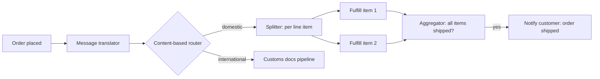

## Why Enterprise Integration Patterns exist

Once an organization has more than one system of record, it has an integration problem. An order comes in through a web storefront, needs to update inventory in a warehouse system, trigger a shipping label in a logistics platform, and post a journal entry in the general ledger. None of those systems were built together, none of them share a database, and none of them can be forced to change on your schedule. Someone has to move data between them reliably, in a way that survives one system being slow, one being down, and one changing its data format without warning.

Gregor Hohpe and Bobby Woolf's *Enterprise Integration Patterns* (2003) gave this problem a shared vocabulary: a catalog of roughly 65 named patterns for connecting systems through asynchronous messaging. The patterns themselves predate the book — they were already common practice in EDI, message queuing middleware, and early service buses — but naming them mattered. "Let's put a content-based router in front of the claims processor" says in one sentence what used to take a paragraph of if/else description. That vocabulary still holds up in 2026, whether the transport underneath is a message broker, a Kafka topic, a webhook, or an HTTP API — the patterns describe *shapes of the problem*, not a specific product.

This module covers the patterns you'll reach for constantly: how messages travel (channels), how they get shaped and routed, and the reliability patterns — idempotency, the outbox pattern, dead-letter queues — that keep an integration correct when networks are unreliable and consumers occasionally crash mid-message. These are durable concepts: they don't change when a vendor renames a product or bumps a version number, which is exactly why they're worth learning as concepts first.

## Messaging channels: point-to-point vs. publish-subscribe

A **message channel** is the conduit a message travels through between systems — conceptually a virtual pipe, whether it's implemented as a queue, a topic, or something else.

**Point-to-point channels** guarantee that exactly one consumer receives and processes each message, even if several consumers are listening. This is the natural shape for work that must happen exactly once per message: "charge this credit card," "generate this invoice." If two consumers both process the same charge message, you've double-charged a customer.

**Publish-subscribe channels** deliver each message to every subscriber. This suits events that many parts of the system care about independently: "order placed" might need to update inventory, notify the warehouse, and update a recommendation model, and none of those three consumers should have to know about the other two, or block each other.

Picking the wrong channel type is a common early mistake: putting a broadcast event on a point-to-point queue means only one interested consumer ever sees it; putting a must-happen-once command on a pub-sub topic means it might run twice unless every consumer is independently idempotent.

## Shaping and routing messages

Real integrations rarely connect two systems that already agree on format. A handful of patterns handle that mismatch:

- **Message translator** converts a message from one system's data format into another's — e.g., a legacy fixed-width EDI record into JSON. It keeps the two systems from needing to know about each other's internal representations directly.
- **Content-based router** inspects a message's content and sends it down one of several channels based on that content — e.g., route insurance claims over $10,000 to a manual-review queue and everything else to auto-approval.
- **Message router** is the general pattern: something in the middle decides where a message goes next, decoupling the sender (who just wants "handle this claim") from the routing decision.
- **Splitter** breaks one composite message into several individual ones — e.g., an order with five line items becomes five separate "fulfill this item" messages, each independently processable and independently retryable.
- **Aggregator** does the reverse: it collects related messages (correlated by an order ID, say) and combines them into a single outgoing message once some condition is met — all five line items shipped, or a timeout elapsed. The aggregator is inherently stateful, which makes it one of the harder patterns to implement correctly: it has to track partial state, handle messages that never arrive, and decide when "good enough" beats "wait forever."

This diagram is a typical shape: a translator normalizes the incoming message, a content-based router sends domestic vs. international orders down different paths, a splitter fans a multi-item order out into independent per-item work, and an aggregator waits for all of that work to finish before emitting a single downstream event. Each box is independently testable and independently scalable — that decoupling is the entire point of the pattern language.

## Idempotency: designing for "at least once"

Networks fail mid-request. A consumer can crash after doing the work but before acknowledging the message, which means the broker will redeliver it. Because of this, almost every real messaging system gives you **at-least-once delivery**, not exactly-once — a message might be processed more than once, and your code needs to cope.

**Idempotency** is the property that processing the same message twice produces the same result as processing it once. It's the standard way to live with at-least-once delivery without building a distributed exactly-once protocol (which is expensive and, across independent systems, not really achievable in the general case).

Practical ways to get idempotency:

- **Natural idempotency**: some operations already are — "set status to shipped" gives the same end state no matter how many times you run it. Prefer these designs when you can.
- **Idempotency keys**: attach a unique key to each logical operation (an order ID, a client-generated UUID) and have the consumer check "have I already processed this key?" before doing the work, typically via a unique constraint in a database table. This is the standard approach for non-naturally-idempotent operations like "charge this card" or "increment this counter."
- **Deduplication windows**: some brokers offer built-in deduplication over a time window, which helps with rapid redelivery but isn't a substitute for a durable idempotency key if a redelivery can arrive hours or days later.

Idempotency is a property of the *consumer*, not the message broker — no broker configuration alone gives you it, because the failure mode that requires it (crash after processing, before acknowledging) is inherently outside the broker's view.

## The outbox pattern

A common bug: a service updates its own database and then publishes a message about that change — two separate operations against two separate systems. If the process crashes between them, you get one of two bad outcomes: the database committed but the message never went out (a downstream system now has stale data with no way to know), or the message went out but the database transaction rolled back (downstream systems act on a change that never actually happened).

The **transactional outbox pattern** solves this by writing the outgoing message into an "outbox" table in the *same* database transaction as the business change. Both succeed or both roll back together — ordinary ACID guarantees, no distributed transaction needed. A separate process (a poller, or a change-data-capture reader like Debezium watching the database's write-ahead log) then reads unpublished rows from the outbox table and publishes them to the message broker, marking them as sent once the broker acknowledges. If that publisher itself crashes after publishing but before marking the row sent, it will republish on restart — which is fine, because the consumer is idempotent. The outbox pattern and consumer-side idempotency are a matched pair: the outbox guarantees at-least-once *publishing*, idempotency guarantees safe at-least-once *consumption*.

## Dead-letter queues and retry strategy

Some messages will never process successfully — a permanently malformed payload, a downstream record that was deleted before the message arrived. If a consumer keeps retrying such a message forever, it blocks the queue behind it (head-of-line blocking) and can burn resources in an infinite retry loop.

A **dead-letter queue (DLQ)** is where messages go after they've failed processing some bounded number of times. Moving a message to the DLQ does three things: it stops it from blocking the main queue, it preserves the message so nothing is silently lost, and it gives operators a place to look — a healthy system has an empty DLQ, and anything landing there deserves alerting, not a shrug.

Retry strategy matters as much as the DLQ itself:

- **Exponential backoff** (with jitter) spaces out retries so a downstream outage doesn't get hammered by a thundering herd of simultaneous retries the moment it recovers.
- **Bounded retry counts** are what eventually route a message to the DLQ rather than retrying indefinitely.
- **Distinguish transient from permanent failures** where you can: a timeout or 503 is worth retrying; a validation error on the payload itself generally is not, and should go straight to the DLQ (retrying it just wastes time before it lands there anyway).
- **Replay tooling**: a DLQ is only useful operationally if there's a way to inspect a dead message, fix the underlying cause, and replay it back onto the main queue — otherwise it's just a place messages go to be forgotten.

## Contracts and versioning

Once two systems are integrated through a message format, that format is a contract, even if nobody wrote it down as one. Changing it breaks every consumer that depends on the old shape unless you're careful.

The safest changes are additive and backward-compatible: adding a new optional field. Consumers that don't know about it ignore it; consumers that do can use it. Renaming or removing a field, or changing a field's type or meaning, is a breaking change and needs an explicit strategy — a new message version published alongside the old one during a migration window, a schema registry that enforces compatibility rules before a producer is allowed to publish, or a documented deprecation timeline with monitoring on who's still consuming the old shape. The specific tooling (a given schema registry product's compatibility modes, for instance) is worth checking against current vendor docs before you rely on it — that's the kind of detail that changes across product versions.

## Enterprise implementation

Consider a mid-size logistics company running a warehouse management system, a customer-facing order portal, and a third-party carrier API, none of which were designed to talk to each other. Historically, the order portal called the warehouse system's REST API synchronously at checkout time to reserve inventory and kick off fulfillment. It worked at low volume, but at around 15,000 orders/day the warehouse system's occasional slow responses (P99 north of 4 seconds during peak restocking windows) started timing out checkout requests, and a nontrivial fraction of "failed" checkouts had, in fact, silently succeeded on the warehouse side — leaving the storefront and the warehouse disagreeing about whether an order existed.

The fix followed the pattern language directly. Checkout no longer calls the warehouse system synchronously; instead, placing an order writes the order row and an `OrderPlaced` event into an outbox table in the same transaction. A publisher process reads the outbox and puts the event on a message broker. A content-based router downstream inspects each order's shipping destination: domestic orders go to a queue the warehouse system's own consumer drains at its own pace; international orders are split — one message per line item — because customs documentation has to be generated and approved per item, and a single failing item shouldn't block the other nine. An aggregator watches for all line items of an international order to clear customs processing before emitting a single `ReadyToShip` event, rather than notifying the customer nine separate times.

The warehouse consumer is idempotent by construction: each `OrderPlaced` message carries the order's UUID as an idempotency key, and the consumer's first step is an `INSERT ... ON CONFLICT DO NOTHING` against a table keyed on that UUID before doing any inventory work — so a redelivered message (which happens routinely, since the broker guarantees at-least-once delivery and the consumer occasionally crashes mid-batch) is a no-op the second time. Messages that fail warehouse processing three times — typically a SKU that was deleted from the catalog after the order was placed — land in a dead-letter queue that pages the fulfillment on-call team rather than retrying forever; a small internal tool lets them inspect, fix, and replay a dead message once the underlying data problem is resolved.

The result: checkout latency dropped from a synchronous call bounded by the warehouse system's worst-case response time to a single fast database write, order/warehouse disagreement went away because there's no longer a "did the second call succeed" ambiguity, and a warehouse system outage no longer takes checkout down with it — orders simply queue up and drain once the warehouse system recovers. The tradeoff, and it's a real one, is that "order placed" and "warehouse reserved this order's inventory" are no longer the same instant — the system is eventually consistent, and the storefront has to show "processing" rather than an instant confirmation. That's a genuine UX cost, traded deliberately for reliability at a scale where the synchronous approach was already breaking.

## Summary

Enterprise Integration Patterns give you a shared vocabulary for a problem every growing organization eventually hits: moving data reliably between systems that don't share a database and can't be forced to change together. Channels decide delivery semantics (point-to-point vs. pub-sub); routers, translators, splitters, and aggregators decide *where* a message goes and *how* it's shaped; idempotency, the outbox pattern, and dead-letter queues are what keep the whole thing correct when networks and processes fail partway through — which they will. None of this requires a specific vendor's product to implement conceptually, though production systems obviously need a real broker, database, and consumer runtime underneath. Learn the shapes first; the tooling underneath will keep changing.
