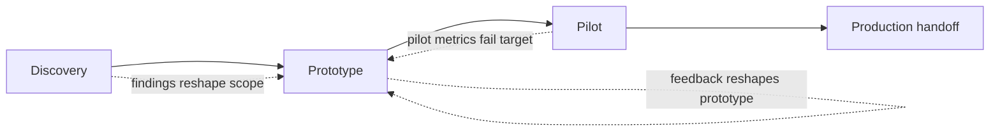

## What forward deployed engineering is

A forward deployed engineer (FDE) is a software engineer who embeds inside a customer's organization and builds working software there, rather than staying on the vendor's side of the relationship and handing over a spec, a config guide, or a support ticket queue. The term borrows military vocabulary: "forward deployed" means operating at the point of action, close to the problem, instead of from a rear base. The FDE sits with the customer's engineers, attends their standups, writes code against their data, and stays on the hook until something real is running in their environment.

Palantir popularized the role in the early 2010s. Its early customers were intelligence and defense agencies that often could not fully articulate their requirements up front — sometimes for operational-security reasons, sometimes because the problem itself was fuzzy until someone started building against real data. Traditional product discovery (write a spec, build to the spec, ship a release) did not work when the customer couldn't say precisely what they needed until they saw a working prototype. Palantir's answer was to put engineers directly into the customer's workflow: watch how analysts actually worked, build something in days, get it in front of them, and iterate. For years, Palantir had more FDEs than product engineers, and the model became central to how the company sold and delivered software at all.

The role has since spread well beyond Palantir. As of 2026, forward deployed engineering — often now labeled "Forward Deployed AI Engineer" or "Applied AI Engineer" — has become one of the fastest-growing technical job categories, driven by AI companies whose products are powerful but require significant integration work to deliver value in a specific enterprise's environment. Anthropic, OpenAI, Scale AI, and Databricks, among others, now run Applied AI or Forward Deployed teams whose job is to embed with strategic customers and turn a general-purpose model or platform into a working, production application solving that customer's actual problem.

## How this differs from implementation engineering and traditional consulting

It helps to place FDE work on a spectrum next to two roles it's often confused with.

**Implementation engineering** (common in SaaS and iPaaS platforms — Workday, Salesforce, MuleSoft, SAP BTP) typically means configuring a vendor's product to match a customer's requirements: mapping fields, building integration flows inside a low-code designer, setting up connectors, writing some scripting glue. The product's capabilities set the boundary. An implementation engineer rarely writes general-purpose application code or touches the customer's own codebase.

**Traditional management consulting** produces recommendations, roadmaps, and slide decks. The deliverable is often a plan for someone else to build, not working software. Consultants may never write a line of production code, and the relationship between "advice given" and "value delivered" can be loose — the org has to actually execute the plan.

**Forward deployed engineering** sits further out on the technical and embedded ends of both axes:

| Dimension | Traditional consulting | Implementation engineering | Forward deployed engineering |
|---|---|---|---|
| Primary deliverable | Recommendations, roadmap | Configured vendor product | Working software in production |
| Code ownership | Rarely writes code | Configures within product boundaries | Writes and ships general-purpose code |
| Embedding | Periodic workshops, readouts | Project-based, structured phases | Day-to-day, often on the customer's own repos/infra |
| Time horizon | Strategy, weeks to months | Defined implementation project | Discovery to production, iterating continuously |
| Success measure | Plan accepted | System configured per spec | Customer workflow measurably improved |

The core distinction is this: an FDE builds working software, owns it through to production, and is judged on whether a real workflow got measurably better — not on whether a document was well received or a feature was configured correctly. That means FDEs need strong general software engineering skills (they are frequently writing orchestration code, data pipelines, or agent workflows from scratch, not just wiring together no-code blocks), plus the customer-facing skills of a consultant: they have to run discovery conversations, manage stakeholder expectations, and translate a vague executive ask into a scoped, buildable problem.

## What companies look for in FDE hires

Postings across Anthropic, OpenAI, Palantir, and others converge on a similar profile, and it's worth naming the pattern rather than any single company's exact wording (job requirements change quickly, so treat specifics as illustrative):

- **Strong, general software engineering ability.** FDEs write production code — often Python or TypeScript, often against unfamiliar codebases and infrastructure they don't control. This is not a "no-code configuration" job.
- **Comfort with ambiguity.** The starting brief is usually vague ("help us use AI for claims processing"), not a spec. The FDE has to convert that into something buildable.
- **Customer-facing communication.** FDEs sit with executives, subject matter experts, and the customer's own engineers, often in the same week. They need to run a discovery conversation as capably as they debug a pipeline.
- **Bias toward shipping.** The expectation is a working prototype in days, not a design document in weeks. Perfectionism that delays a demo is treated as a liability.
- **Domain adaptability.** Different engagements land in insurance, logistics, healthcare, financial services, defense. FDEs are expected to get functionally competent in a new domain fast, without becoming a specialist in all of them.
- **Ownership through production.** The job doesn't end at the demo. FDEs are commonly expected to stay involved through hardening, security review, and handoff, because a demo that never reaches production hasn't delivered value.

## Problem discovery with customers

The hardest and most valuable part of the job is rarely the coding — it's figuring out what to build. Customers usually arrive with one of two problems: either they describe a solution ("we want a chatbot") without having validated that it addresses their actual bottleneck, or they describe a pain point in vague terms ("claims take too long") without any measurable target. Good discovery does three things:

1. **Finds the highest-value workflow, not the most visible one.** Executives often nominate a flashy, customer-facing use case because it's easy to imagine in a slide. The FDE's job is to go talk to the people who actually do the work — claims adjusters, support agents, underwriters — and find the workflow where the current process is genuinely slow, expensive, or error-prone, and where an AI-assisted or software-assisted version would make a measurable dent. This usually means shadowing people doing the job, reading a sample of real cases (not hypothetical ones), and asking "where does this stall?" rather than "what would you like a computer to do for you?"

2. **Defines measurable success before writing code.** "Faster" and "better" are not targets. A discovery conversation should end with something like: cut average claim review time from 40 minutes to under 15; reduce false-positive escalations from 30% to under 10%; increase the percentage of tickets resolved without human review from 20% to 50%. A number, a baseline, and a time frame. Without this, there's no way to know whether the pilot worked, and no way to make the case for expanding it into production.

3. **Surfaces constraints early.** Data residency, regulatory review, latency requirements, who owns and can approve production deployment, what systems the solution has to integrate with — these determine whether an approach that works in a demo can ever reach production. Finding out about a hard compliance constraint after building for three weeks is a failure of discovery, not of engineering.

## Scoping a pilot that can reach production

A pilot is not a proof of concept that gets thrown away — it should be architected as a smaller, real version of the production system, so that "it worked in the pilot" translates into "we can extend this," not "we have to start over." Good pilot scoping:

- **Picks a narrow but real slice of the workflow**, end to end, rather than a shallow demo across the whole workflow. A pilot that fully automates one claim type end to end teaches you more than a demo that half-automates every claim type.
- **Uses real (or realistically representative) data and real integration points** wherever possible, even if the volume or user base is limited. A pilot built entirely on synthetic data or a mocked-up API often hides the actual hard problems (data quality, latency, edge cases) until production, when they're far more expensive to fix.
- **Defines the handoff criteria up front.** What does "ready for production" mean — a security review, a defined error rate, sign-off from a specific stakeholder? Agreeing on this before the pilot starts avoids an open-ended "just keep improving it" spiral.
- **Keeps the blast radius small.** Pilots should be reversible and low-risk if they fail: a shadow mode that runs alongside the existing process, a human-in-the-loop review step, a limited rollout to one team.

## Rapid prototyping philosophy

FDE work runs on a much faster cycle than traditional enterprise software delivery. The operating assumption is that a working, imperfect prototype in front of real users within days teaches you more than weeks of requirements-gathering, because it turns "what do you want?" (a question customers are often bad at answering in the abstract) into "is this right?" (a question they can answer immediately when looking at something concrete). A few principles that follow from this:

- **Build to learn, not to ship the first version.** Early prototypes exist to surface wrong assumptions cheaply. Expect to throw away or substantially rework the first attempt.
- **Favor the thinnest slice that produces a real reaction.** A prototype that handles one realistic case well is more useful than one that handles many cases shallowly.
- **Get in front of the actual end users, not just the executive sponsor.** The people doing the underlying work will notice gaps that a sponsor won't.
- **Keep the loop short.** Days between "we have an idea" and "here's a working version to react to," not weeks. This is a cultural and process discipline as much as a technical one — it requires customers willing to give feedback quickly and FDEs willing to build without waiting for complete requirements.

This philosophy does not mean skipping engineering rigor once a pilot heads toward production — it means sequencing discovery and validation before investing in hardening, rather than hardening a solution built on unvalidated assumptions.

The dashed loops matter as much as the forward path: an FDE engagement is not a waterfall. Discovery findings can send you back to reshape the prototype, and a pilot that misses its target metric usually means going back to rebuild, not pushing an underperforming system into production anyway.

## Enterprise implementation

A mid-size insurance claims processor approached an AI vendor with a vague ask: "we want to use AI to speed up claims." The FDE assigned to the account did not start writing code. Over the first week, they shadowed four claims adjusters handling real cases, sat in on a triage meeting, and pulled a sample of 200 recent claims from the case management system.

Two things came out of discovery that reshaped the entire scope. First, the flashy idea the executive sponsor had pitched — a customer-facing chatbot for claim status — turned out to be low value: customers rarely called in during the parts of the process that were actually slow. Second, the real bottleneck was upstream: adjusters spent 20-30 minutes per claim manually cross-referencing incoming documents (photos, repair estimates, police reports) against policy coverage terms before they could even start their assessment. That step was repetitive, document-heavy, and measurable.

The FDE and the customer agreed on a target before any code was written: cut document cross-referencing time from an average of 25 minutes to under 8 minutes per claim, for auto claims specifically (the highest-volume claim type), without reducing accuracy below the adjusters' existing error rate. That gave the team a number to build toward and a number to walk away from if the pilot didn't hit it.

The prototype, built in under a week, ingested a claim's documents, extracted the relevant fields, and cross-referenced them against the policy — producing a draft summary an adjuster could review and correct rather than trusting blindly. It ran in shadow mode alongside the existing manual process for two weeks on real, live claims, so adjusters could compare the system's output to their own work without the outcome affecting a real claim yet. That surfaced a real production constraint discovery hadn't caught: some document types arrived as low-quality scanned images that the extraction step handled poorly, which sent the team back to rework that part of the prototype rather than proceeding to a wider rollout on a false assumption of readiness.

Once accuracy on the corrected document pipeline stabilized and cross-referencing time on the shadowed claims dropped to 7 minutes on average, the customer signed off on a limited production pilot: one claims team, auto claims only, with a defined path to expand by claim type once the pilot held its numbers for a full month. The handoff criteria — error rate, latency, and a security review of how policy data was handled — had been agreed with the customer before the pilot even began, so "are we ready for production" was a checklist, not a negotiation.

The engagement illustrates the pattern: discovery replaced a vague, low-value ask with a specific, measurable one; the prototype was scoped narrow and real rather than broad and shallow; the pilot ran against live data with a human still in the loop; and a hard constraint discovered mid-pilot sent the team backward to fix it rather than forward into production on an unvalidated assumption.
