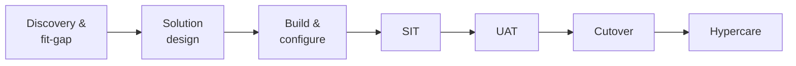

## What an implementation engineer actually does

Enterprise software doesn't get "installed" the way a phone app does. A platform like a CRM, an ERP, a scheduling system, or an integration hub arrives as a blank frame, and someone has to configure it to match how a real organization actually works, move its data in, prove it behaves correctly, and cut the business over from the old system without stopping the business. That someone is the implementation engineer.

It's worth being precise about how this role differs from adjacent ones, because job titles in this space are used loosely:

- **Consultant / functional consultant** focuses on the business process — interviewing stakeholders, documenting requirements, recommending how a process *should* work. An implementation engineer takes that recommendation and builds it: configuration, data migration scripts, integrations, test plans.
- **Solutions engineer / sales engineer** works pre-sales, building demos and proofs of concept to win the deal. Once the deal is signed, the implementation engineer inherits the (often optimistic) scope and has to make it real.
- **Support engineer** works post-go-live, on a system that's already stable, fixing defects and answering "how do I" questions. The implementation engineer's job ends (formally) at the end of hypercare, when support takes over.

In practice, one person often wears more than one of these hats on a small project. But the implementation engineer's core identity is the same regardless of company size: they are the person accountable for turning a signed contract and a set of business requirements into a system that real users log into on Monday morning and get their work done with, correctly, on schedule.

## Discovery: finding out what's actually true

A project doesn't start with configuration — it starts with discovery. Discovery workshops are structured working sessions with the people who actually do the job today: the AR clerk, the scheduler, the warehouse supervisor. The goal isn't to write a requirements document that restates the sales pitch; it's to find out what's *actually* happening, including the exceptions, workarounds, and spreadsheets-taped-to-the-side-of-the-official-system that never make it into a process diagram.

Good discovery digs for three things:

1. **The happy path** — what the process looks like when nothing goes wrong.
2. **The exceptions** — returns, holds, partial shipments, mid-cycle plan changes, the customer who always pays by wire three weeks late. These are usually where the real complexity (and the real cost) lives.
3. **The reasons behind current configuration** — a weird field or approval step often exists because of a compliance requirement, a past incident, or a specific customer's contract. Understanding *why* prevents you from "cleaning up" something that was load-bearing.

The output of discovery feeds directly into **fit-gap analysis**: for each requirement, is it a *fit* (the platform does this out of the box, possibly with configuration), a *gap* (the platform doesn't do this, and you need a workaround, a customization, or a process change), or a candidate for **business process change** (the requirement exists because "that's how we've always done it," not because it's actually necessary — and adapting the business to the platform's standard capability is cheaper and more maintainable than adapting the platform).

Fit-gap analysis should be written down, not just discussed. A simple table — requirement, fit/gap/BPC, effort estimate, owner — becomes the backbone of the solution design and the project's scope negotiations. It's also the artifact you point to later when someone asks "why doesn't the system do X" during UAT.

## The solution design document

The solution design document (SDD) — sometimes called a design workbook or functional specification — is the bridge between discovery and build. It answers, for each in-scope process: what does the target-state process look like, what configuration implements it, what data objects and integrations are involved, and what (if anything) requires custom development.

A good SDD is specific enough that a different engineer could pick it up and build from it. "Configure approval routing" is not a design; "purchase orders over $10,000 route to the requester's manager, then to finance if the vendor is new" is. The SDD is also the primary artifact for sign-off — getting the business owner to approve the design *before* build starts is far cheaper than discovering a misunderstanding during UAT, when changing course means rework, schedule slip, and a harder conversation.

## Configuration vs. customization

Almost every enterprise platform draws a line between **configuration** — using the settings, fields, and options the platform vendor built and supports, no code required — and **customization** — writing code, scripts, or extensions to make the platform do something it doesn't do natively.

The tradeoff is real and recurring on every project:

| | Configuration | Customization |
|---|---|---|
| Speed to build | Fast | Slower |
| Upgrade risk | Low — vendor tests configuration paths | Higher — custom code can break on platform upgrades |
| Support | Usually covered by vendor support | Often the implementation partner's or customer's own responsibility |
| Flexibility | Bounded by what the platform allows | Effectively unlimited |

The rule of thumb most experienced implementation engineers apply: exhaust configuration first, and treat every customization as a cost that will be paid again at every future upgrade. That doesn't mean customization is always wrong — sometimes a genuine competitive differentiator for the business justifies it — but it should be a deliberate, documented decision made against the fit-gap analysis, not a default reached because nobody looked for the configuration option.

## Data migration: extract, cleanse, map, load, reconcile

Data migration is usually the highest-risk, most underestimated part of an implementation. The lifecycle has five stages, and skipping or rushing any one of them shows up as a painful surprise near cutover.

1. **Extract** — pull data out of the source system(s). This sounds trivial and rarely is: source systems often have data spread across custom fields, attachments, and related tables that aren't obvious from the UI.
2. **Cleanse** — fix data quality problems *before* they move to the new system. Duplicate customer records, inconsistent address formats, orphaned records pointing at deleted parents, free-text fields that should have been picklists — these are far cheaper to fix in the source system (or in a staging area) than after they've landed in production and users are already relying on them.
3. **Map** — define how each source field and value translates to a target field and value. Mapping isn't just "column A goes to column B" — it includes value translation (source status codes to target picklist values), object relationships (how source parent/child records become target parent/child records), and decisions about what simply doesn't migrate.
4. **Load** — actually move the data, almost always in a staged, repeatable way: a full trial load well before cutover, one or more delta/mock loads to rehearse timing and catch mapping errors, and the final production load during the cutover window itself.
5. **Reconcile** — verify that what landed in the target system matches what was extracted, using record counts, control totals (e.g., sum of order values), and spot checks against source records. Reconciliation is not optional and not a five-minute glance — it's the step that catches silent data loss before users do.

Because reconciliation depends on a repeatable load process, most teams run the full migration cycle at least twice before cutover: once as a "mock load" weeks in advance to shake out mapping bugs, and again as a full dress rehearsal close to cutover, timed like the real thing.

## Testing: SIT and UAT are not the same thing

**System integration testing (SIT)** verifies that the pieces work together correctly from a technical standpoint: does data flow correctly between the new system and its integrated neighbors, do batch jobs run in the right order, do error-handling paths actually trigger. SIT is run by the implementation team, often using synthetic or migrated test data, and it's where you want to find integration defects — because they're expensive to fix later and invisible to end users until something breaks in production.

**User acceptance testing (UAT)** verifies that the system, as built, actually supports the business processes the way the business needs — and it's run *by business users*, following real-world scenarios, not by the implementation team. UAT is where discovery gaps and misunderstandings in the SDD finally surface, because business users notice things engineers don't: "this report is missing the field my manager asks for every Friday," or "this approval step doesn't match how we actually handle rush orders."

Running these in the wrong order, or skipping SIT and going straight to UAT, means business users spend their limited testing time hitting integration bugs instead of validating the business process — burning goodwill and time you don't get back.



## Cutover planning: runbooks and rollback

Cutover is the finite window — often a weekend — during which the business stops using the old system and starts using the new one. Because it's high-stakes and time-boxed, it's planned down to the level of a **runbook**: a minute-by-minute (or at least hour-by-hour) sequence of steps, each with an owner, an expected duration, a verification check, and a clear go/no-go decision point.

Two things separate a professional cutover plan from an improvised one:

- **Explicit go/no-go checkpoints.** At defined points (e.g., "after the production data load and reconciliation"), someone with the authority to make the call explicitly decides whether to proceed, pause, or roll back — based on pre-agreed criteria, not a gut feeling made at 2 a.m.
- **A real rollback plan.** Not "we'll figure it out" — an actual, tested procedure for returning to the old system if a go/no-go checkpoint fails: what state the old system needs to be restored to, how long that takes, and who has to be notified. A rollback plan you haven't rehearsed is a rollback plan you can't trust when you need it most.

Cutover plans are also communication plans: who is told when the freeze on the old system starts, when users get access to the new system, and what happens if the schedule slips.

## Hypercare: the project isn't done at go-live

**Hypercare** is the period immediately after go-live — typically one to four weeks — where the implementation team stays engaged at elevated readiness: faster response times, a dedicated channel for issues, daily (sometimes twice-daily) stand-ups reviewing open items, and the team that built the system on hand to diagnose problems, because they have the context a standard support queue doesn't yet have.

Hypercare exists because go-live is where theory meets the full, messy reality of production volume and every user's individual habits — issues that never surfaced in UAT because UAT never exercises every edge case at once, at full scale, under real time pressure. A defined hypercare exit criteria (e.g., "issue volume below N per day for M consecutive days, no open severity-1 defects") is what lets the project formally close and hand off to steady-state support, instead of hypercare quietly dragging on forever.

## Enterprise implementation

Consider a mid-size healthcare provider migrating off a legacy, on-premises scheduling system onto a modern cloud scheduling platform, ahead of the legacy vendor's end-of-support date.

Discovery workshops with front-desk staff, schedulers, and clinic managers surfaced a gap the sales demo never showed: the legacy system supported a "hold and confirm" pattern for high-demand specialists, where a slot was tentatively held for 24 hours pending insurance verification before being confirmed — a workaround built over years to reduce no-shows, not a standard feature of the new platform. Fit-gap analysis flagged it as a gap; rather than customize the new platform's booking engine, the team chose a business process change — moving the hold logic into a lightweight status field and a scheduled task, configured (not coded) in the new platform, which the business accepted after a design walkthrough of the alternative.

Data migration covered five years of appointment history and active patient-provider relationships. Cleansing turned up several thousand duplicate patient records — the same patient registered under slightly different name spellings at different clinic locations — which had to be resolved with the clinics before the mapping step, not after, because merging patient identities post-load risked orphaning appointment history. Two mock loads, three weeks apart, caught a mapping error where insurance plan codes weren't translating correctly, well before it could reach production.

SIT verified the new system's integration with the insurance eligibility-check service and the patient billing system, catching a timeout defect under load that never would have surfaced in a UAT session using one test patient at a time. UAT, run by actual schedulers using real (de-identified) upcoming appointments, caught that the new system's cancellation email didn't include the clinic's parking instructions — small, but the kind of detail that generates support calls at scale.

Below is an excerpt from the cutover weekend runbook:

```
Cutover Runbook — Scheduling Platform Go-Live
Window: Friday 6:00 PM – Sunday 6:00 AM

Fri 6:00 PM  Freeze new appointment entry in legacy system
             Owner: Clinic Ops Lead | Verify: legacy system read-only confirmed

Fri 6:30 PM  Final incremental data extract from legacy system
             Owner: Migration Lead | Verify: record counts logged, match expected delta

Fri 8:00 PM  Production data load into new platform
             Owner: Migration Lead | Verify: load job completes, error log reviewed

Fri 10:00 PM Reconciliation: patient count, appointment count, control totals
             Owner: Data QA | Verify: reconciliation report signed off

Fri 11:00 PM GO/NO-GO CHECKPOINT 1 (data reconciled?)
             Decision owner: Program Director
             If NO-GO: execute rollback procedure R1 (restore legacy write access,
             notify clinics of delay), reschedule cutover

Sat 8:00 AM  Smoke test: create/reschedule/cancel appointment in new platform
             Owner: QA Lead | Verify: all core workflows pass

Sat 10:00 AM Integration check: insurance eligibility service, billing system
             Owner: Integration Lead | Verify: test transactions succeed end-to-end

Sat 12:00 PM GO/NO-GO CHECKPOINT 2 (system ready for staff access?)
             Decision owner: Program Director

Sat 1:00 PM  Grant staff access to new platform, distribute quick-reference guide
             Owner: Training Lead

Sun 6:00 AM  Legacy system moved to read-only archive; hypercare begins Monday 7:00 AM
```

Hypercare ran for three weeks, with a dedicated Slack channel and daily 15-minute stand-ups. The most common issue in week one wasn't a defect at all — it was schedulers not yet trusting the new hold-and-confirm status field, so the team ran two extra floor-support sessions to build confidence, and by week three, issue volume had dropped below the agreed exit threshold and the project formally handed off to the standard support queue.
