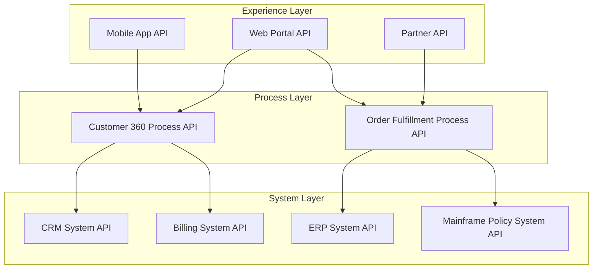

## Why layer your APIs at all

Most integration problems don't start as integration problems. They start as a request: "show the customer's order history on the new mobile app" or "let the partner portal check inventory in real time." The naive path is to build one API that goes straight from the mobile app to the ERP system. It works, once. Then the web team needs the same data, shaped differently. Then a partner needs it too, with different auth. Now you have three point-to-point integrations hitting the same backend, each with its own retry logic, its own field mappings, its own idea of what "order status" means. Change a column in the ERP and three teams scramble.

API-led connectivity is MuleSoft's answer to that failure mode: instead of point-to-point spaghetti, you build a small number of purposeful, reusable APIs organized into three layers. Each layer has one job, and each API in a lower layer can be reused by many APIs in the layer above it. The underlying idea — decouple consumers from producers with a stable interface in between — isn't unique to MuleSoft; it's the same motivation behind service meshes, the backend-for-frontend pattern, and API gateways generally. MuleSoft just gives the pattern a specific vocabulary and toolset (Anypoint Platform, API Manager, Exchange, Anypoint Studio).

## The three layers

**System APIs** sit closest to the source of truth. Each one wraps a single backend system — a mainframe, an ERP, a CRM, a database — and exposes it through a normalized interface, hiding the ugly parts: proprietary protocols, brittle schemas, connection pooling limits. A system API doesn't know anything about the business process it will be used in. It just answers questions like "give me policy 4471" reliably and consistently.

**Process APIs** orchestrate and shape. They call one or more system APIs, combine the results, apply business rules, and transform the data into a shape that's useful for a purpose — but still without knowing who the final consumer is. A "get customer 360" process API might call a CRM system API and a billing system API and merge the results. This is where most of the actual integration logic lives: sequencing calls, handling partial failures, deciding what "customer" means when two systems disagree.

**Experience APIs** are consumer-specific. Each one is shaped for exactly one channel — a mobile app, a web app, a partner-facing API — and exposes only what that channel needs, in the format that channel wants (maybe a flatter JSON structure for mobile to save bandwidth, or a GraphQL-style shape for a web SPA). Multiple experience APIs can sit on top of the same process APIs.



Notice the fan-in at the system layer: two process APIs both need order-related data, but neither has to know how to talk to the ERP directly — they just call the ERP system API. Add a fourth channel next year and you build one new experience API against process APIs that already exist. That's the payoff: the cost of adding a new consumer drops from "build another end-to-end integration" to "build a thin adapter."

The tradeoff is real too. Three layers of APIs means three layers of network hops, three layers of deployments, and three teams (or one team wearing three hats) who need to agree on contracts. For a two-system integration that will only ever have one consumer, API-led connectivity is over-engineering. It earns its cost when reuse across multiple consumers and multiple backend systems is actually expected — which is most enterprise integration estates, but not every project.

## Designing the contract first

MuleSoft's tooling encourages API-first design: you write the API specification — describing resources, methods, request/response schemas, and error responses — before writing implementation code. Historically this was commonly done in RAML (RESTful API Modeling Language), a MuleSoft-originated YAML-based spec format; OpenAPI (Swagger) is also widely supported and has become the more common industry default. Whichever format is used, the point is the same: the contract is a design artifact that both the API's builder and its consumers can review and agree on before a line of flow logic is written. Anypoint Exchange acts as the catalog where these specs (and reusable connectors, templates, and fragments) get published so other teams can discover and reuse them instead of re-building.

Designing the contract first also forces the layering question early: is this a system, process, or experience API? What does it expose, and — just as important — what does it deliberately *not* expose? A system API for a mainframe policy system shouldn't leak mainframe field names like `POL-STAT-CD` into its response; it should expose `policyStatus` as a normalized enum, with the ugly translation happening inside that one API.

## DataWeave: the transformation language

Mule flows move data between systems, and the data rarely arrives in the shape a caller wants. DataWeave is Mule's functional transformation language, used both in explicit `Transform Message` steps and inline in expressions throughout a flow. It reads a lot like a mix of JSON literal syntax and functional pipelines.

A representative transform — flattening a nested order payload from a system API into the flatter shape a mobile experience API wants:

```dataweave
%dw 2.0
output application/json
---
{
  orderId: payload.order.id,
  customer: payload.order.customer.fullName,
  total: payload.order.lineItems reduce ((item, acc = 0) -> acc + (item.price * item.qty)),
  items: payload.order.lineItems map (item) -> {
    sku: item.sku,
    qty: item.qty,
    lineTotal: item.price * item.qty
  },
  placedAt: payload.order.createdAt as DateTime as String {format: "yyyy-MM-dd"}
}
```

A few things worth noting about the style: `map` and `reduce` are first-class, there's no explicit looping construct, and type coercion (`as DateTime as String {format: ...}`) is explicit rather than implicit — DataWeave won't silently guess that a string is a date. That explicitness is deliberate: implicit type coercion is a common source of subtle integration bugs (a date that parses differently depending on locale, a number that silently truncates), so DataWeave makes you say what you mean.

DataWeave modules can be shared across flows in a project, and increasingly across projects, which matters at the process-API layer where the same shaping logic (say, "merge two representations of a customer address") gets reused across several orchestrations.

## Error handling: fail on purpose

Mule 4 organizes runtime failures into a hierarchy of typed errors — for example an HTTP call that times out surfaces as `HTTP:TIMEOUT`, which is itself a more specific case of a broader connectivity error type. Typed errors matter because they let you handle failures at the right level of specificity: catch `HTTP:TIMEOUT` differently from `HTTP:NOT_FOUND`, but let both fall through to a generic connectivity handler if you don't need finer-grained behavior.

Two patterns show up constantly:

- **On Error Continue** — the flow recovers and keeps going, producing some response (often a fallback or default value). Use this when a failure is expected and survivable, like a non-critical enrichment call failing while the core response still ships.
- **On Error Propagate** — the flow stops, the error bubbles up, and whatever's downstream (an API-level error handler, or the caller) has to deal with it. Use this when the failure means the request genuinely cannot be fulfilled.

At the API layer, a **global error handler** centralizes this instead of repeating try/catch-equivalent logic in every flow: one handler maps internal error types to consistent HTTP status codes and a uniform error body shape, so every API in a project — and ideally every API across a whole platform — returns errors the same way. That consistency is what makes a process API's automated retry logic (or a consuming team's client code) reliable: it can trust that a 503 always means "retry with backoff" and a 400 always means "don't retry, the request itself is wrong," regardless of which system API originally failed underneath.

## Testing with MUnit

MUnit is Mule's own testing framework, built specifically for testing Mule flows — it runs flows in isolation, lets you mock connectors and external calls so tests don't depend on live backends, and asserts on the resulting payload, headers, or error type. A typical MUnit test for a process API mocks the system APIs it calls (returning canned responses, or deliberately returning an error to test the error-handling path), runs the flow under test, and asserts the shape of the output.

The testing philosophy that matters most: test each layer against mocks of the layer below it, not against real backends. A system API's tests exercise the real (or a sandboxed) backend connection, because that's the one place the integration with the real system actually needs verifying. A process API's tests mock the system APIs it depends on — you're testing orchestration logic, not the ERP's uptime. This keeps the test suite fast and deterministic, and it means a process API's tests don't break just because a system API it depends on is temporarily down or its data changed.

## CI/CD for Mule applications

At a high level, a Mule CI/CD pipeline looks like most other application pipelines, with a few Mule-specific stages: build and package the Mule application (producing a deployable archive), run MUnit tests and fail the build on regressions, publish the API specification and any reusable assets to an internal catalog so other teams can discover them, and deploy to progressively higher environments (dev, then test, then production) with environment-specific configuration injected at deploy time rather than baked into the package. Policies like rate limiting, authentication, and client ID enforcement are typically applied at the gateway/API-management layer during or after deployment rather than hard-coded into the application, which lets platform teams change throttling or auth requirements without a code redeploy.

## Enterprise implementation

Consider a mid-size insurance carrier running personal auto and home policies. Policy and claims data lives on a mainframe that's been in place for over twenty years; billing runs on a separate on-prem system; and the carrier has recently adopted a SaaS CRM for the call-center and agent-facing tools. Three consumers need a unified view of a customer: the agent portal (web), a new mobile app for policyholders, and a claims-intake API used by an external claims-adjustment vendor.

Before any redesign, each of those three consumers had its own direct integration to the mainframe (via a batch file feed, in one case, and a screen-scraping adapter in another) and its own separate integration to the CRM. Nine point-to-point connections in total, each maintained by whichever team built it, none of them agreeing on what fields like "policy status" or "customer since" actually meant — the mainframe used a two-character status code, the CRM had its own free-text status field, and the two only loosely tracked each other.

The team introduced three system APIs — one wrapping the mainframe (translating fixed-width mainframe records into normalized JSON, with a mapping table that converted proprietary status codes into a documented enum), one wrapping the billing system, and one wrapping the CRM. On top of those, two process APIs: a "customer profile" API that merges identity and policy data from the mainframe and CRM system APIs and resolves conflicts with a documented precedence rule (CRM wins for contact details, mainframe wins for policy facts), and a "claims context" API that combines policy and billing data for the claims-intake use case. Each of the three original consumers was rebuilt as a thin experience API against these process APIs: the agent portal API returns a richer payload with internal notes fields, the mobile app API returns a stripped-down payload to minimize mobile data usage, and the claims vendor's API enforces stricter field-level redaction (no billing account numbers) appropriate for an external partner.

The measurable results after the first two process APIs and their three experience APIs went live: the nine original point-to-point integrations collapsed to three system APIs plus two process APIs — five reusable assets instead of nine bespoke ones. When the carrier later added a fourth consumer (an internal analytics dashboard), it shipped as a new experience API in about three weeks, reusing the existing process APIs entirely, versus the eight-to-twelve week estimate the integration team gave for a from-scratch mainframe connection under the old approach. Global error handling standardized on a single error-response shape across all five backend-facing APIs, which let the claims vendor's client implement one retry policy instead of three. The mainframe system API's MUnit suite, run against a sandboxed mainframe test region, caught a fixed-width field-offset regression during a mainframe patch cycle before it reached production — a defect class that had previously surfaced as a silent data-corruption bug in the old batch-file integration.
