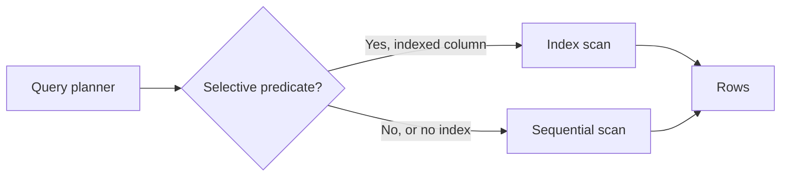

## Why indexes matter

A sequential scan reads every row in a table. That is fine for a 500-row lookup table, and ruinous for a 50-million-row orders table. An index lets Postgres jump straight to the rows that match a predicate instead of walking the whole heap.

> **Rule of thumb**: an index trades write cost and disk space for read speed. Every index you add slows down `INSERT`/`UPDATE`/`DELETE` on that table a little, because Postgres has to maintain it too.

## Index types

| Type | Good for | Bad for |
|---|---|---|
| B-tree | Equality and range queries (`=`, `<`, `BETWEEN`) | Full-text, containment |
| GIN | JSONB containment (`@>`), arrays, full-text | High-churn tables (index bloats fast) |
| GiST | Geometric data, range types, nearest-neighbor | Simple equality |
| BRIN | Huge, naturally-ordered tables (time-series) | Randomly-ordered data |



## Reading EXPLAIN ANALYZE

```sql
EXPLAIN (ANALYZE, BUFFERS)
SELECT * FROM orders WHERE customer_id = 42;
```

Look at three things: the actual row count versus the planner's estimate (a big gap means stale statistics), whether the plan uses an index or sequential scans, and how many buffers were read from disk versus cache.

## Enterprise implementation: partial indexes at scale

A mid-size fintech's `payments` table held 400M rows, but 95% of read traffic only ever touched the ~2M rows in `status = 'pending'`. Indexing the whole table was wasteful. Switching to a partial index — `CREATE INDEX ON payments (created_at) WHERE status = 'pending'` — cut index size by roughly 40x and brought p95 query latency down from ~800ms to ~12ms, because the smaller index fit entirely in shared_buffers.
