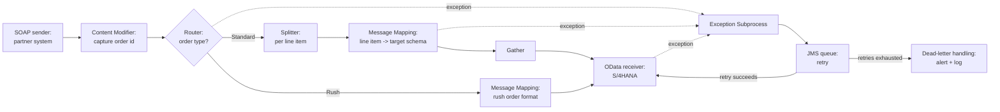

## What an iFlow actually is

An integration flow (iFlow) is the unit of design in SAP Cloud Integration, the runtime that sits inside SAP Integration Suite on SAP BTP. You build an iFlow visually, as a graph of steps connecting a sender to a receiver, and SAP Cloud Integration compiles that graph into an Apache Camel route that runs on a managed, containerized Java runtime. You never see the Camel XML directly (though it exists under the hood), and you never manage the servers it runs on — you design the flow, deploy it, and SAP Integration Suite handles scaling, patching, and availability.

Two things follow from that runtime model. First, an iFlow is fundamentally message-oriented: something arrives (a SOAP call, a file drop, an IDoc, an HTTP POST), gets transformed and routed inside the flow, and something leaves (a call to another system, a file written, a response sent back). Second, because the runtime is shared and multi-tenant, every iFlow competes for the same pool of worker threads and memory on its integration runtime node — a flow with an unbounded loop or an oversized in-memory payload doesn't just hurt itself, it can degrade every other flow sharing that node. Designing efficient iFlows is not a nice-to-have; it's part of the job.

An iFlow lives inside an Integration Package, which is the deployable and versionable unit you promote across tenants (dev, test, production) using transport mechanisms like the Content Agent or CI/CD pipelines built on the OData-based Cloud Integration APIs. Each iFlow itself has an ID, a name, and one or more sender/receiver pairs, and it is edited in the Web-based iFlow editor inside Integration Suite's Design perspective.

## Adapters: the sender and receiver ends

Every iFlow starts with a **sender adapter** (how a message enters SAP Cloud Integration) and ends with one or more **receiver adapters** (how a message leaves it, or how the flow calls out to an external system mid-flow). Adapters are the part of the platform that changes most often — new protocol versions, new connection options, new security settings — so treat any specific adapter capability, field name, or supported version as something to verify against the current SAP Help Portal rather than something to memorize permanently. The durable part is the pattern: pick the adapter that matches the protocol the other side actually speaks.

- **SOAP** — used when the partner system exposes a WSDL-based web service, which is still common for older SAP and non-SAP enterprise systems. You either import the WSDL to generate the sender/receiver configuration or point at a SOAP endpoint URL. SOAP adapters exist in multiple flavors (SOAP 1.x, WS-* style) depending on what the counterpart requires.
- **IDoc** — the classic SAP-to-SAP or SAP-to-middleware document exchange format, used heavily for master data and transactional documents (sales orders, deliveries, material master) moving in or out of SAP ECC or S/4HANA. The IDoc adapter talks RFC underneath and typically requires an on-premise connectivity path (via SAP Cloud Connector) when the source or target is an on-premise SAP system.
- **OData** — the adapter of choice for calling S/4HANA, SuccessFactors, or other SAP cloud/on-premise systems that expose OData services, and for consuming or exposing OData V2/V4 APIs from an iFlow itself. It's a natural fit for structured, entity-based CRUD-style integration rather than document-oriented messaging.
- **SFTP** — file-based integration: picking up files dropped by a partner or legacy system, or writing files out (extracts, batch exports) for another system to pick up. The SFTP sender polls a directory on a schedule; the SFTP receiver writes files, often with a temporary-name-then-rename pattern to avoid partial reads on the other side.
- **HTTP(S)** — the general-purpose adapter for exposing a REST-ish endpoint as a sender, or calling out to an HTTP/REST API as a receiver, including cases where no more specific adapter exists.

Besides these, JMS is worth calling out separately because it's not really a partner-facing protocol — it's SAP Cloud Integration's own internal message queue, and it's central to the resilience pattern covered later in this lesson.

Picking an adapter is a matter of matching the counterpart's actual capabilities: don't force OData onto a system that only speaks flat files over SFTP, and don't build a custom HTTP polling loop when a purpose-built adapter already exists for the protocol in front of you.

## The core steps inside a flow

Once a message is inside the flow, you compose behavior from a fairly small set of step types, combined the same way regardless of which adapters bookend the flow:

- **Content Modifier** — the workhorse step. It sets or reads message headers, properties, and the message body; it's how you stash a value from the payload into a property for later use (e.g., capture an order number before you transform the body away from it), or construct a new body from a template.
- **Router** — evaluates conditions (often against headers or properties set by a Content Modifier) and sends the message down exactly one of several branches, similar to a switch statement. Used for things like "if country = US, go to the US receiver; otherwise the EU receiver."
- **Splitter** — breaks one message into many, either by an XML/JSON structural split (e.g., one message per line item) or a general splitter with a custom expression. Each split message flows through the rest of the route independently (or is merged back later with a Gather step).
- **Gather** — the counterpart to Splitter: it collects the individual messages produced by a split back into an aggregate result once all of them (or enough of them, per its completion condition) have been processed.
- **(Looping) Process Call** — invokes a separate, reusable integration process (a "local integration process") as a subroutine, optionally once per item in a list. This is how you factor out shared logic — a common enrichment step, a shared error-handling routine — instead of copy-pasting it into every flow.

A typical structural pattern: Content Modifier to capture correlation data → Router to decide a path → Splitter to fan out a collection → Message Mapping or Groovy per item → Gather to recombine → receiver adapter call.

## Transformation: message mapping vs. Groovy scripting

Two tools do the heavy lifting of turning one message shape into another:

**Message Mapping** is the graphical, declarative option: you connect source fields to target fields, optionally through built-in or custom functions, and SAP Cloud Integration generates the transformation. It's the right default because it's readable by someone who didn't write it, versions cleanly, and doesn't require a developer to maintain. Use it whenever the transformation is expressible as field-to-field mapping, even with conditional logic and standard functions.

**Groovy Script** (or, less commonly, JavaScript) steps give you full programmatic control over the message: its body, headers, properties, and attachments, via the Camel `Message` API exposed to script. Reach for Groovy when the logic genuinely needs a general-purpose language — complex conditional branching that a mapping can't express cleanly, calling out to a shared utility, non-trivial string or date manipulation, or building a body format a graphical mapping can't produce well (e.g., irregular text formats). The tradeoff is real: scripts are harder to review at a glance, easier to introduce a bug that only shows up on an edge-case payload, and each one is one more thing a future maintainer has to actually read rather than see in a diagram. A useful rule of thumb: prefer mapping for structure, reserve Groovy for logic that structure alone can't express.

## A representative iFlow

## Resilience: exception subprocesses and JMS-based retry

Any step in the main process can fail — a downstream system is briefly unreachable, a mapping hits unexpected data, a network call times out. SAP Cloud Integration lets you attach an **exception subprocess** to a flow: if an unhandled exception occurs anywhere in the main process, control transfers to the exception subprocess instead of the flow simply failing. Inside it you typically log the error with enough context to diagnose it, decide whether the failure looks transient (network blip, temporary unavailability) or permanent (bad data, invalid mapping), and branch accordingly.

For transient failures, the common pattern uses the **JMS adapter** as a durable retry queue: the message is put onto a JMS queue with a configured retry interval, and the JMS sender picks it back up and re-attempts delivery. This decouples "the call failed right now" from "the call fails forever" — the message survives a runtime restart and gets another attempt without the caller (or a human) having to intervene, up to a bounded number of attempts. Once retries are exhausted, the message typically lands in a dead-letter queue, which should trigger an alert and get logged for manual reprocessing rather than looping silently forever. Because this pattern involves header names, retry-count semantics, and specific configuration flags on the JMS adapter, the specifics of setting it up are worth checking against the current SAP Help Portal guidance rather than treating any one blog's steps as fixed.

## Monitoring

Deployed iFlows show up in the Monitor perspective of Integration Suite, where you can see message processing status (completed, failed, escalated, retry), drill into an individual message's processing log and payload trace (if trace is enabled — it has a performance and storage cost, so it's normally switched on temporarily for troubleshooting, not left on permanently in production), and inspect JMS queue depth and age for messages waiting on retry. Alerting rules can notify a team when failure rates or queue backlogs cross a threshold, which is what turns the exception-subprocess-plus-JMS pattern from "the message won't get silently lost" into "someone actually finds out when it needs attention."

## Enterprise implementation

A global manufacturer runs S/4HANA on-premise as its ERP backbone and a cloud-based SaaS transportation management system (TMS) for freight planning. Roughly 15,000 sales orders a day need to flow from S/4HANA into the TMS as shipment requests, and status updates (booked, in transit, delivered) need to flow back.

The outbound iFlow is triggered by an IDoc sent from S/4HANA (via SAP Cloud Connector, since S/4HANA is on-premise) whenever a delivery is created. A Content Modifier captures the delivery number and plant into message properties before the payload is touched further. A Router checks the plant against a lookup of TMS-enabled plants — about 40 of the manufacturer's 120 plants are live on the new TMS, with the rest still using the legacy process — and only routes in-scope deliveries forward. A Splitter breaks multi-line deliveries into per-shipment messages (large orders can have 30+ line items consolidating into a handful of shipments), each mapped via Message Mapping from IDoc structure to the TMS's OData shipment-request schema, then sent through an OData receiver adapter to the TMS.

The inbound status-update iFlow runs the other direction: the TMS calls an HTTPS sender endpoint whenever a shipment status changes, at a volume of roughly 60,000 callbacks a day across all shipments (each shipment generates multiple status events). A Groovy script step handles the TMS's slightly irregular timestamp format, which a plain mapping struggled to normalize consistently. The mapped status update is then sent to S/4HANA over the IDoc receiver adapter.

Both flows carry an exception subprocess wired to a JMS retry queue, since the TMS occasionally has short maintenance windows (typically under five minutes) during which calls fail with connection errors rather than business errors. Retrying for up to 20 minutes with backoff resolves the overwhelming majority of these automatically; the small remainder that still fail land in a dead-letter queue that pages the integration on-call team, rather than silently dropping shipment updates that finance and logistics both depend on for accurate order status.
